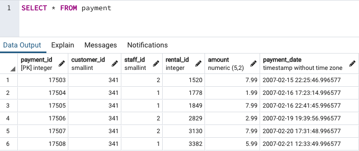
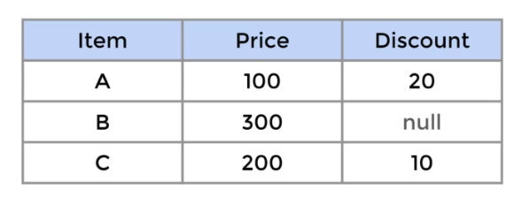

# SQL Guide

This file contains my personal guide on SQL. All levels are covered progressively and additional technical details on Relational Databases are provided.

If you are looking for a cheat sheet rather than a guide, check the co-located file [`sql_catalogue.txt`](sql_catalogue.txt), which I plan to complete sometime.

I composed this document after refreshing my SQL knowledge by following several courses/tutorials:

- [The Complete SQL Bootcamp](https://www.udemy.com/course/the-complete-sql-bootcamp/), created by José Marcial Portilla (Udemy)
- [SQL for Data Analysis](https://www.udacity.com/course/sql-for-data-analysis--ud198) by Udacity.
- [Python MySQL Tutorial](https://www.w3schools.com/python/python_mysql_getstarted.asp) from W3schools.

**Table of Contents:**

- [SQL Guide](#sql-guide)
  - [1. Introduction \& Setup](#1-introduction--setup)
    - [1.1 Installation: `PostgreSQL` \& `pgAdmin`](#11-installation-postgresql--pgadmin)
    - [1.2 `pgAdmin` Overview](#12-pgadmin-overview)
    - [1.3 Command Line Interface (CLI) psql: Installation \& Setup](#13-command-line-interface-cli-psql-installation--setup)
      - [Mac](#mac)
      - [Windows](#windows)
      - [WSL 2 (and Linux in general)](#wsl-2-and-linux-in-general)
      - [Basic psql Commands](#basic-psql-commands)
  - [2. SQL Statement Fundamentals](#2-sql-statement-fundamentals)
    - [`SELECT`](#select)
    - [`SELECT DISTINCT`](#select-distinct)
    - [`COUNT`](#count)
    - [`SELECT WHERE`](#select-where)
    - [`ORDER BY`](#order-by)
    - [`LIMIT`](#limit)
    - [`BETWEEN`](#between)
    - [`IN`](#in)
    - [`LIKE` and `ILIKE`](#like-and-ilike)
    - [Challenges / Exercises](#challenges--exercises)
  - [3. `GROUP BY` Statements](#3-group-by-statements)
    - [3.1 Aggregate Functions](#31-aggregate-functions)
    - [3.2 `GROUP BY`](#32-group-by)
      - [`GROUP BY`: Examples](#group-by-examples)
      - [`GROUP BY`: Challenges / Exercises](#group-by-challenges--exercises)
    - [3.3 `HAVING`](#33-having)
      - [`HAVING` Challenges / Exercises](#having-challenges--exercises)
  - [4. `JOINS`](#4-joins)
    - [4.1 `AS`](#41-as)
    - [4.2 `INNER JOIN`](#42-inner-join)
    - [4.3 `FULL OUTER JOIN` + `WHERE`](#43-full-outer-join--where)
    - [4.4 `LEFT (OUTER) JOIN` + `WHERE`](#44-left-outer-join--where)
    - [4.5 `RIGHT (OUTER) JOIN` + `WHERE`](#45-right-outer-join--where)
    - [4.6 `UNION`](#46-union)
    - [4.7 Challenges: Very Important Examples](#47-challenges-very-important-examples)
  - [5. Advanced SQL Commands](#5-advanced-sql-commands)
    - [5.1 Obtaining Time Information](#51-obtaining-time-information)
    - [5.2 Extracting Time Information](#52-extracting-time-information)
    - [5.3 Mathematical Functions](#53-mathematical-functions)
    - [5.4 String Functions and Operations](#54-string-functions-and-operations)
    - [5.5 Sub-Queries](#55-sub-queries)
    - [5.6 Self-Joins](#56-self-joins)
    - [5.7 `OVER`: Window Functions (PostgreSQL)](#57-over-window-functions-postgresql)
  - [6. Creating Databases and Tables](#6-creating-databases-and-tables)
    - [6.1 Data Types](#61-data-types)
    - [6.2 Primary and Foreign Keys](#62-primary-and-foreign-keys)
    - [6.3 Constraints](#63-constraints)
    - [6.4 `CREATE` Table](#64-create-table)
    - [6.5 `INSERT` Rows into a Table](#65-insert-rows-into-a-table)
    - [6.6 `UPDATE` the Rows of a Table](#66-update-the-rows-of-a-table)
    - [6.7 `DELETE` to Remove Rows from a Table](#67-delete-to-remove-rows-from-a-table)
    - [6.8 `ALTER` a Table](#68-alter-a-table)
    - [6.9 `DROP TABLE`](#69-drop-table)
    - [6.10 `CHECK` Constraints](#610-check-constraints)
  - [7. Conditional Expressions and Procedures](#7-conditional-expressions-and-procedures)
    - [7.1 `CASE`](#71-case)
      - [Challenge Task](#challenge-task)
    - [7.2 `COALESCE`: Replace `null` Values to Perform Mathematical Operations](#72-coalesce-replace-null-values-to-perform-mathematical-operations)
    - [7.3 `CAST`: Convert One Data Type into Another](#73-cast-convert-one-data-type-into-another)
    - [7.4 `NULLIF()`](#74-nullif)
    - [7.5 Views](#75-views)
    - [7.6 Import \& Export of CSV Tables](#76-import--export-of-csv-tables)
  - [8. PostGreSQL with Python](#8-postgresql-with-python)
  - [9. Assessments](#9-assessments)
    - [Assessment 1 (After Section 3: Fundamentals + `GROUP BY`)](#assessment-1-after-section-3-fundamentals--group-by)
    - [Assessment 2 (After Section 5: Joins \& Advanced Commands)](#assessment-2-after-section-5-joins--advanced-commands)
    - [Assessment 3 (After Section 8: `CREATE` Tables)](#assessment-3-after-section-8-create-tables)
  - [10. SQLite + SQLAlchemy with Python](#10-sqlite--sqlalchemy-with-python)
    - [Installation](#installation)
    - [Datasets and Code](#datasets-and-code)
    - [SQLite CLI](#sqlite-cli)
    - [SQLite with SQLAlchemy](#sqlite-with-sqlalchemy)
    - [More About SQLAlchemy](#more-about-sqlalchemy)
    - [SQLite with sqlite3 in Python](#sqlite-with-sqlite3-in-python)
    - [SQLite + SQLAlchemy: Example Project](#sqlite--sqlalchemy-example-project)
  - [11. MySQL with Python](#11-mysql-with-python)
    - [Installation](#installation-1)
    - [Connecting ad Database](#connecting-ad-database)


## 1. Introduction & Setup

Relational databases are collections of inter-related tables able to collect very large amounts of data.
SQL is the interfacing language with which we can interact with those relational databases.
Each table is like a spreadsheet tab (but can contain much more data): columns are fields, rows are entries.
There are many implementations of SQL, being [PostgreSQL](https://en.wikipedia.org/wiki/PostgreSQL) one of them: it is open source, free; PostgreSQL has additional methods, but they are clearly warned here.

Alternatives to PostgreSQL: MySQL, Oracle, etc.

### 1.1 Installation: `PostgreSQL` & `pgAdmin`

We install two things (on a Mac; Windows is equivalent):
- [PostgreSQL](https://www.postgresql.org): SQL engine to interact with our databases
- [pgAdmin](https://www.pgadmin.org): web-based GUI to interact with our databases using PostgreSQL; one of the most popular.

Documenation / Help:
- [PostgreSQL Documentation](https://www.postgresql.org/docs/current/)
- [pgAdmin Documentation](https://www.pgadmin.org/docs/pgadmin4/6.5/index.html)

In the following, installation instructions are provided following an indented style I use typically for howtos.
Also, an example database `dvdrentals` from the Udemy course is restored.

```

Install PostgreSQL
    Download PostgreSQL installer from web (V. 14.2 - 15.3):
        https://www.postgresql.org/download/macosx/
        https://www.postgresql.org/download/windows/
    Click on intaller
    Select/leave default
    Password
        o-y-a
        do not forget it, otherwise we need to re-install it again!
        PostgreDQL superuser pw
    Port: 5432 (leave suggested one)
        Make sure port is not blocked by any firewall
        PostgreSQL will be listening on that port
    Next, next, next
    Finish

Install pgAdmin
    Download pgAdmin from web: https://www.pgadmin.org/download/
        pgAdmin 4 - v6.5 / v7.3
        Download the DMG file: pgadmin4-6.5.dmg / .exe
    Click on DMG installed: drag & drop app to Applications folder

Restart computer
    A new postgres user might appear

Open pgAdmin
    A new pw is required: master pw for pgAdmin
        although it is a different one,
        we can use the same as for PostgreSQL
        o-y-a
    The browser or a web-based GUI is opened
    We can connect to engine servers on the left panel
        introduce postgres pw

Create and Restore Example Database
    Udemy course material: example database file that should not be uncompressed:
    `./data/dvdrental.tar`

    On pgAdmin:
    Select PostgreSQL on left panel > Databases
        Right click: create: dvdrental
            New database appears on left panel
            Now, we can populate that database
                - restoring it from a file
                - inserting tables and rows manually
                - importing CSVs
                - ...
        Right click on dvdrental DB > Restore...
            Path to dvdrental.tar
            Options/data-object
                sections: activate
                    Data, Pre-Data, Post-Data
            Restore
        Right click on dvdrental DB > Refresh
            Changes take place!

Test we can interact with our restored DB using SQL
    On pgAdmin left panel: 
    Right click on dvdrental DB > Query Tool
    Insert
        SELECT * FROM film;
    Run (Play button)
        We get all entries from film table

```

### 1.2 `pgAdmin` Overview

We often interact with a database using SQL in a tool such as `pgAdmin`.
In the following, a schematic overview is given with an indented style.

```
Left panel: Servers: PostgreSQL engine is a server
    Databases hanging from it
    We can have several servers if we have several PostgreSQL versions installed
    Every time we connect to a server, we need to introduce the postgres user pw
Right side: Dashboard
    If selected a database, its activity is shown on dashboard
File > Preferences
    Themes (Dark)
    Query tool: font size, etc.
    Dashboards: choose what to display
We can select an object on the left panel
    and right click for options
    or on menu, then select Object / Tool

DB, right click -> Query Tool (dvdrental)
    Tabs
        Query Editor: we write our SQL queries here
        Query History: list of all SQL queries we have performed, very useful!
            Copy / Copy to Editor
        Output: result after running the query
    To execute a query: Run / Play / F5
```

### 1.3 Command Line Interface (CLI) psql: Installation & Setup

Note that we always need a user+password for the database (in Postgres).

Postgres creates automatically a `postgres` user with admin privileges; its associated default password is `postgres`.

However, we will usually create a new user+password.

#### Mac

I found the following URL and followed what's explained in it:
[https://www.timescale.com/blog/how-to-install-psql-on-mac-ubuntu-debian-windows/](https://www.timescale.com/blog/how-to-install-psql-on-mac-ubuntu-debian-windows/)

Mac installation:

```bash
brew doctor
brew update
brew install libpq
# After installation, add paths
echo 'export PATH="/opt/homebrew/opt/libpq/bin:$PATH"' >> ~/.zshrc
source ~/.zshrc
```

After installation, we can connect to a database started via `pgAdmin` or any other UI as follows using the CLI (Terminal):

```bash
#psql -h [HOSTNAME] -p [PORT] -U [USERNAME] -W -d [DATABASENAME]
psql -h localhost -p 5432 -U postgres -W -d dvdrental
# PostgreSQL user (postgres) pw is requested due to option -W: we insert the defined one
# The prompt appears
# dvdrental=#
# Now, we can enter in the prompt any SQL query we want
# but with proper capitals and ending with ;
SELECT COUNT(*) FROM film;
# For help
help
# 
# To exit the connection
\q
```

#### Windows

The `psql` binary should be installed in the system.
We add to the environment variables where the path where it is, e.g.

    C:\Program Files\PostgreSQL\15\bin

Then, we can start a PS or cmd shell and use `psql` as follows:

```powershell
#psql -h [HOSTNAME] -p [PORT] -U [USERNAME] -W -d [DATABASENAME]
psql -h localhost -p 5432 -U postgres -W -d dvdrental
# PostgreSQL user (postgres) pw is requested due to option -W: we insert the defined one
# The prompt appears
# dvdrental=#

# Note that we might be accessing a DB which sits remotely
# so we have a portforwarding to a given port
psql -h localhost -p 35432 -U dbadmin -W -d my_db
# PostgreSQL user (dbadmin) pw is requested due to option -W: we insert the defined one
# The prompt appears
# my_db=#
# Now, we can enter in the prompt any SQL query we want
# but with proper capitals and ending with ;
SELECT COUNT(*) FROM table;
# For help
help
# 
# To exit the connection
\q
```

#### WSL 2 (and Linux in general)

After WSL 2 is correctly installed with a linux distirbution (e.g., Ubuntu), we open a WSL CLI:

```bash
# Install Postgres and start it
sudo apt update
sudo apt upgrade -y
sudo apt install postgresql postgresql-contrib
sudo service postgresql start

# Modify the configuration file
# Replace {version} with installed version
sudo nano /etc/postgresql/{version}/main/pg_hba.conf
# Change the METHOD value of following lines.
# The usual value is peer/... and it needs to be changed to md5
# The lines refer to the Unix domain socker ("local") and to host IPv4 and IPv6 connections
# 
#   # TYPE  DATABASE        USER            ADDRESS                 METHOD
#   local   all             postgres                                md5
#   local   all             all                                     md5
#   host    all             all             127.0.0.1/32            md5
#   host    all             all             ::1/128                 md5
#
# Ctrl+X, Y

# Restart service
sudo service postgresql restart

# Now we can login
psql -U postgres # pw: postgres

# NOTE: if the METHOD of the postgres user is NOT changed to md5
# we can still login with
sudo -u postgres psql
```

Links, sources: 

- [Get started with databases on Windows Subsystem for Linux](https://learn.microsoft.com/en-us/windows/wsl/tutorials/wsl-database)
- [Set up PostgreSQL on WSL2 and Access with pgAdmin on Windows](https://chloesun.medium.com/set-up-postgresql-on-wsl2-and-connect-to-postgresql-with-pgadmin-on-windows-ca7f0b7f38ab)

#### Basic psql Commands

```powershell
#psql -h [HOSTNAME] -p [PORT] -U [USERNAME] -W -d [DATABASENAME]
# The prompt appears
# my_db=#

# Now, we can enter in the prompt any SQL query we want
# but with proper capitals and ending with ;
SELECT COUNT(*) FROM table;

# For help
help

# Help on psql commands
\?

# List all tables in the database
\dt

# List all database users + privileges
\du

# List all databases on the server
\l

# Connect to another database in the server without leaving psql
\c

# Describe a specific table, showing its columns and properties
\d table_name

# Export the contents of a table to a CSV
# The file is output relative to the CWD where psql was launched, locally,
# even when we're accessing reomtely to a databse
\copy my_table TO 'path/to/output.csv' WITH (FORMAT CSV, HEADER);

# Execute SQL commands from a file:
# It allows you to run a SQL script stored in a file directly within psql
# The file is read from the CWD where psql was launched, locally,
# even when we're accessing reomtely to a databse
\i file.sql

# Open the default text editor to write and execute multi-line SQL queries
\e

# ENable/disable query timimg
\timing

# Toggle expanded display mode: result smore readable
\x

# Change password of user
\password current_password

# To exit the connection
\q
```


## 2. SQL Statement Fundamentals

The way we are going to use to interact with the database (DB) `dvdrental` is `pgAdmin`. We select the database > right click > Query Tool. There, we input our queries, capitalizing by convention SQL tokens for readability, although that is not technically necessary.

A database (DB) is composed by tables that contain columns or fields. In `pgAdmin`, those tables and fields can be seen in the `Schemas`:
- select DB, expand its items
- item `Schemas`
- subitems `Tables`, `Columns`

Some general notes:

- Comments are created with `--`; they can be at beginning/end of line.
- Statements can be in one or multiple lines.
- A statement finishes with `;`. However, `pgAdmin` seems to work also without that.
- Numbers (int/float) are represented by regular numbers.
- Strings and dates are represented by single quotes: 'text'.
- Space and indentations are ignored, but we should write understandable code with proper indentations and lines.

We need to think that SQL statements are usually the translation to code of business questions.

###  `SELECT`

 `SELECT` is used to extract the entries of desired columns from desired tables.

```sql
-- Grab two columns from a table
-- Note that query order is irrelevant
-- SQL might return entries/rows in an unordered order, actually the most efficient one
SELECT column_1, column_2 FROM table_name;
-- Grab all columns from a table
-- Do it only if necessary, since we might be pulling a lot of data!
-- It is often a quick & dirty way of visualizing all the columns/fields of a table
SELECT * FROM table_name;
-- 
-- dvdrental examples
SELECT * FROM actor;
-- 
SELECT last_name, first_name FROM actor;
--
SELECT first_name, last_name, email FROM customer;
```

###  `SELECT DISTINCT`

`SELECT DISTINCT` selects entries (rows) in a column that are unique.

```sql
SELECT DISTINCT column_name FROM table_name
-- We should use parenthesis if several columns are queried
SELECT DISTINCT(column_name) FROM table_name
-- dvdrental examples
SELECT DISTINCT release_year FROM film;
SELECT DISTINCT(rental_rate) FROM film;
SELECT DISTINCT(rating) FROM film;
```

###  `COUNT`

The function `COUNT()` returns the number of rows/entries that match a condition. Note that it offeen takes `*` as argument, because it does not matter the column in which we count the entries: any column could be possible. However, sometimes a column is selected so that it is more clear what we are doing.

```sql
-- COUNT() is a function, it needs ()
-- It counts the rows/entries in the passed column/table
SELECT COUNT(column_name) FROM table_name;
-- If no condition is passed, it does not matter which column we use, we can pass *
SELECT COUNT(*) FROM table_name;
-- It makes sense to combine it with conditions or other functions
-- Count number of distinct last names from all customers
SELECT COUNT(DISTINCT(last_name)) FROM customer;
--
-- dvdrental examples
SELECT COUNT(*) FROM payment;
--
SELECT COUNT(DISTINCT(amount)) FROM payment;
```

###  `SELECT WHERE`

`SELECT WHERE` allows to define conditions to the rows of the selected columns.
Conditions can be defined with:

- comparison operators: `=, >, <, >=, <=, <>, !=`
- logical operators: `AND, OR, NOT`

Notes:

- There is no `==` and that not-equal can be done in two ways: `<>, !=`.
- The condition columns don't need to appear in the `SELECT` clause.
- Strings are passed with single quotes `'string'` and comparisons are case-sensitive.

```sql
-- General syntax (it can be in one line)
SELECT col_1, col_2
FROM table_a
WHERE condition_alpha;
-- Example: Select entries from fields name & choice, in which name is "David"
SELECT name, choice
FROM table
WHERE name = 'David';
-- Example: multiple conditions
SELECT name, choice
FROM table
WHERE name = 'David' AND choice = 'Red';
--
-- dvdrental examples
SELECT * FROM customer
WHERE first_name = 'Jared';
--
SELECT title FROM film
WHERE rental_rate > 4 AND replacement_cost > 19.99 AND rating = 'R';
--
SELECT COUNT(*) FROM film
WHERE rental_rate > 4 AND replacement_cost > 19.99 AND rating = 'R';
--
SELECT COUNT(*) FROM film
WHERE rating = 'R' OR rating = 'PG-13';
--
SELECT email FROM customer
WHERE first_name = 'Nancy' AND last_name = 'Thomas';
--
SELECT phone FROM address
WHERE address = '23 Workhaven Lane'; 
```

###  `ORDER BY`

SQL queries return entries in different orders, depending on the most efficient way of retrieving them each time. However, we can control the order in which the entries appear. This is done at the end of the query, by indicating the column(s) with respect to which we'd like to order and whether we want ascending/descending order.

Notes:
- Ordering wrt. several columns is usual when a column has duplicate entries, e.g., order by company name and sold amount.
- We can define the order to specific columns.
- Usually, `ORDER BY` appears at the end, but `LIMIT` can go after it.
- `SELECT` specifies only the col display order, not the sorting order, done by `ORDER BY`

```sql
-- General syntax
SELECT col_1, col_2
FROM table_a
WHERE condition_alpha
ORDER BY col_3, col_4 DESC; -- default is ASC
--
-- dvdrental examples
-- We can define DESC/ASC to specific columns
SELECT store_id, first_name, last_name FROM customer
ORDER BY store_id DESC, first_name ASC;
```

###  `LIMIT`

`LIMIT` specifies the number of rows/queries we want. It is often used with `ORDER BY` to get the first/last X entries of a business question.

```sql
-- General syntax
SELECT col_1,
FROM table_a
WHERE condition_alpha
ORDER BY col_2 DESC
LIMIT N; -- N is an integer
--
-- dvdrental examples
-- Which are the 5 most recent and valid (!= 0 ) payments?
SELECT * FROM payment
WHERE amount != 0
ORDER BY payment_date DESC
limit 5;
-- Which are the customer IDs of the first 10 customers who created a payment?
SELECT customer_id
FROM payment
WHERE amount != 0
ORDER BY payment_date ASC
LIMIT 10;
-- Which are the titles of the 5 shortest movies?
-- Note that 'length' is a SQL token; we should avoid using such column names!
SELECT title, length
FROM film
ORDER BY length ASC
LIMIT 5;
-- How many movies last 50 minutes or below?
SELECT COUNT(title)
FROM film
WHERE length <= 50;
```

###  `BETWEEN`

`BETWEEN` can be used to define ranges of values in conditions.
It is equivalent to using `>= X AND <= Y`.

Notes:
- We can combine it with `NOT`.
- We can use it with dates if they are formatted following the ISO 8601 `YYYY-MM-DD`; however, note that the ISO format contains hours and minutes, too, and inclusivity/exclusivity issues might arise depending on when it is considered the day starts.
- If we have a timestamp, the easiest way to convert it to a date is to use the function `DATE()`.

```sql
-- dvdrental examples
-- Payments in value between [8,9]
SELECT *
FROM payment
WHERE amount BETWEEN 8 AND 9;
-- Count the payments out from that region
SELECT COUNT(*)
FROM payment
WHERE amount NOT BETWEEN 8 AND 9;
-- Number of payments the first 2 weeks of February 2007
SELECT COUNT(*)
FROM payment
WHERE payment_date BETWEEN '2007-02-01' AND '2007-02-15';
```

###  `IN`

The `IN` operator allows to write conditions in which a field-entry value must be in a set of possible values; it is equivalent to `BETWEEN` but for categorical data.

NOtes:
- The categories can be numbers, too.
- We can use `NOT IN`.

```sql
-- General syntax
SELECT *
FROM clothes
WHERE color IN ('red', 'blue')
--
-- dvdrental examples
-- Which payments equal to 0.99 or 1.99 USD?
SELECT *
FROM payment
WHERE amount IN (0.99, 1.99);
--
SELECT *
FROM payment
WHERE amount NOT IN (0.99, 1.99);
```

###  `LIKE` and `ILIKE`

`LIKE` and `ILIKE` are used to match patterns. `LIKE` is case-sensitive, `ILIKE` is case-insensitive. We can also use them in combination with `NOT` or any logical operator.

We need to consider these wildcards, which can be combined:

- `_`: any one character or single digit, not blank/null.
- `%`: a sequence of any characters or digits; it could be also null = nothing, blank.
  - All names that start with 'A': `'A%'`
  - All names that end with 'a': `'%a'`

SQL supports full regex capabilities.

```sql
--
-- dvdrental examples
-- Who among the customers has a name starting with J?
SELECT *
FROM customer
WHERE first_name LIKE 'J%'
-- How many among the customers have a name starting with J and surname with S?
SELECT COUNT(*)
FROM customer
WHERE first_name ILIKE 'j%' AND last_name ILIKE 's%';
-- Cutomers with names not containing 'her' after the initial?
SELECT *
FROM customer
WHERE first_name NOT LIKE '_her%';
```

### Challenges / Exercises

```sql
-- dvdrental DB
-- How many payments were larger than 5 USD?
SELECT COUNT(*)
FROM payment
WHERE amount > 5.00;
-- How many actors have a first name that starts with letter P?
SELECT COUNT(actor)
FROM actor
WHERE first_name LIKE 'P%';
-- How many unique districts are our customers from?
SELECT COUNT(DISTINCT(district))
FROM address;
-- Get list of names of those districts
SELECT DISTINCT(district)
FROM address;
-- How many films have a rating of R and a replacement cost between 5 and 15 USD?
SELECT COUNT(title)
FROM film
WHERE rating = 'R'
AND replacement_cost BETWEEN 5 AND 15;
-- How many films have the word 'Truman' in their title?
SELECT COUNT(title)
FROM film
WHERE title LIKE '%Truman%';
```

## 3. `GROUP BY` Statements

### 3.1 Aggregate Functions

Aggregate functions take multiple inputs and return a single output. Official documentation:

[Aggregate Functionsin PostgreSQL](https://www.postgresql.org/docs/9.5/functions-aggregate.html)

Aggregate function calls happen **only** in the `SELECT` or the `HAVING` clause.
Common aggregate functions:

- `AVG()`: it is often combined with `ROUND()` to cut decimal places
- `COUNT()`: it is usually used as `COUNT(*)`, since it returns the number of **rows**, no matter the column.
- `MAX()`
- `MIN()`
- `SUM()`
- `STDDEV_POP()`: population standard deviation
- `STDDEV_SAMP()`: sample standard deviation
- `CORR(Y, X)`: correlation coefficient; X is independent, Y is dependent variable
- `REGR_INTERCEPT(Y, X)`: intercept of linear regression
- `REGR_R2(Y, X)`: R2 of linear regression
- `REGR_SLOPE(Y, X)`: slope of linear regression
- ...

Examples:

```sql
-- All films
SELECT * FROM film;
-- Which is the minimum/maximum replacement value?
SELECT MIN(replacement_cost) FROM film;
SELECT MAX(replacement_cost) FROM film;
-- Note that it doesn't make sense to add more columns after an aggregate function
-- unless that column is the input of an aggregate function, too!
SELECT MAX(replacement_cost), MIN(replacement_cost) FROM film;
-- If arithmetic operations performed, use ROUND(number,decimals)
SELECT AVG(replacement_cost) FROM film;
SELECT ROUND(AVG(replacement_cost),2) FROM film;
```

### 3.2 `GROUP BY`

`GROUP BY` takes a categorical column (categories can be continuous numbers, e.g.: 0.99, 1.99, 4.99, etc.) and groups rows depending on the categories that the rows have in the categorical column. After that grouping, we apply an aggregate function on the groups:


The syntax and usage can be a little bit confusing at the beginning. See notes below in the code.

Important remarks:

- Columns in `SELECT` need to appear in `GROUP BY`.
  - Exception: Aggregate function `AGG()` needs to be in `SELECT`, but not in `GROUP BY`.
- In contrast, not all columns in `GROUP BY` need to appear in `SELECT`
- A nice way to understand what `GROUP BY` is doing is to consider it as the word **per** in the sentence.
- `GROUP BY` needs to come direct after either `FROM` or `WHERE`.
- `ORDER BY` and `LIMIT` appear after `GROUP BY`.
- `ORDER BY` needs to have either the `AGG()` or any col in `GROUP BY`, because these are the columns display by `SELECT`.
- `WHERE` filters **only** categories from category_col; if we want to filter values in other cols, we need to use `HAVING`.

```sql
-- General syntax 1/3
-- Aggregate function AGG() needs to be in SELECT
-- Columns in SELECT need to appear in GROUP BY
-- Exception: AGG() does not need to be in GROUP BY:
-- we use the cols in GROUP BY to group rows
-- and compute the aggregate values on other cols with AGG()
-- In contrast, not all columns in GROUP BY need to appear in SELECT
SELECT category_col, AGG(data_col)
FROM table
GROUP BY category_col
-- General syntax 2/3
-- GROUP BY needs to come direct after either FROM or WHERE
-- WHERE filters __only__ categories from category_col
-- If we want to filter values in other cols, we need to use HAVING
SELECT category_col, AGG(data_col)
FROM table
WHERE category_col != 'A'
GROUP BY category_col
-- General syntax 3/3
-- ORDER BY and LIMIT appear after GROUP BY
-- ORDER BY needs to have either the AGG() or any col in GROUP BY
SELECT company, SUM(sales)
FROM finance_table
GROUP BY company
ORDER BY SUM(sales)
LIMIT 5
```

#### `GROUP BY`: Examples

```sql
-- dvdrental
--
-- Display unique customers; equivalent to DISTINCT
SELECT customer_id 
FROM payment
GROUP BY customer_id
ORDER BY customer_id;
-- Who is consuming the most?
SELECT customer_id, sum(amount)
FROM payment
GROUP BY customer_id
ORDER BY SUM(amount) DESC;
-- Multiple columns
-- Ordered according to first column first, rest afterwards
-- SELECT specifies only the col display order, not the sorting order, done by ORDER BY
SELECT staff_id, customer_id, SUM(amount)
FROM payment
GROUP BY staff_id,customer_id
ORDER BY customer_id;
-- Two ORDER BY
SELECT staff_id, customer_id, SUM(amount)
FROM payment
GROUP BY staff_id,customer_id
ORDER BY customer_id, staff_id;
-- ORDER BY with AGG()
SELECT staff_id, customer_id, SUM(amount)
FROM payment
GROUP BY staff_id,customer_id
ORDER BY SUM(amount);
-- List of amounts earned per day from largest amount to smallest
-- Timestamps need to be converted to dates (days: YYYY-MM-DD) with DATE(timestamp)
SELECT DATE(payment_date), SUM(amount)
FROM payment
GROUP BY DATE(payment_date)
ORDER BY SUM(amount) DESC;
```

#### `GROUP BY`: Challenges / Exercises

```sql
-- dvdrental
--
-- Challenge 1:
-- How many payments did each staff member handle?
SELECT staff_id, COUNT(*)
FROM payment
GROUP BY staff_id
ORDER BY COUNT(*);
-- Challenge 2:
-- What is the average replacement cost per MPAA rating?
SELECT rating, ROUND(AVG(replacement_cost),2)
FROM film
GROUP BY rating
ORDER BY ROUND(AVG(replacement_cost),2);
-- Challenge 3:
-- What are the customers ids of the top 5 customers?
SELECT customer_id, SUM(amount)
FROM payment
GROUP BY customer_id
ORDER BY SUM(amount) DESC
LIMIT 5;
```

### 3.3 `HAVING`

`HAVING` filters **after** an aggregation has taken place, i.e., it comes after a `GROUP BY` clause. It is a filter on the `AGG()` function. In contrast, `WHERE` is a filter that takes place before performing the grouping or aggregate computation.

Remarks:

- `HAVING` appears always with `GROUP BY`; so learn it as `GROUP BY HAVING`.
- `HAVING` is not the replacement of `WHERE`; it is the `WHERE` for `AGG()` functions after `GROUP BY`.


```sql
-- Example:
-- HAVING is a filter on the AGG(), i.e., after grouping has happened
-- WHERE is a filter applied before grouping: e.g., we can remove a category before grouping
-- HAVING appears always with GROUP BY; so learn it as GROUP BY HAVING
SELECT company, SUM(sales)
FROM finance_table
WHERE company != 'Google'
GROUP BY company
HAVING SUM(sales) > 1000
-- 
-- dvdrental
-- Customers who spent at least 100 USD?
SELECT customer_id, SUM(amount)
FROM payment
GROUP BY customer_id
HAVING SUM(amount) > 100;
-- Stores that have at least 300 customers?
SELECT store_id, COUNT(customer_id)
FROM customer
GROUP BY store_id
HAVING COUNT(customer_id) > 300
```

#### `HAVING` Challenges / Exercises

```sql
-- dvdrental
--
-- What customer_ids have 40 or more payments?
SELECT customer_id, COUNT(*)
FROM payment
GROUP BY customer_id
HAVING COUNT(*) >= 40;
-- What are the customer_ids who spent more than 100 USD with staff_id 2?
SELECT customer_id, staff_id, SUM(amount)
FROM payment
WHERE staff_id = 2
GROUP BY customer_id, staff_id
HAVING SUM(amount) > 100;
```

## 4. `JOINS`

With `JOINS` we can combine tables. This is done according to the matching (or not) of tables used in the `JOIN` clause. There are several types of joins, explained with Venn diagrams. Additionally, since things can get more complex, it is common to use aliases with `AS`.

Interesting links: 

- [SQL JOINS Explained with Venn Diagrams](https://blog.codinghorror.com/a-visual-explanation-of-sql-joins/)
- [Wikipedia: SQL JOINS](https://en.wikipedia.org/wiki/Join_(SQL))

Note that joins can be concatenated! See the Challenges (Section 4.7).

### 4.1 `AS`

With `AS` we can create an alias for a column or a result.
The alias name appears in the displayed data/table.
It is often used to make the display of the results more understandable.
Note that `AS`is executed at the very end of a query, so we cannot use it inside the query (e.g., in filtering clauses such as `WHERE` or `HAVING`).

```sql
-- Examples (dvdrental)
--
SELECT COUNT(amount) AS num_transactions
FROM payment
-- Total spent by each customer
SELECT customer_id, SUM(amount) AS total_spent
FROM payment
GROUP BY customer_id;
-- Total spent by each customer that spent at least 100 USD
-- Note that the alias cannot be used in the SQL clause
SELECT customer_id, SUM(amount) AS total_spent
FROM payment
GROUP BY customer_id
HAVING SUM(amount) >= 100;
```

### 4.2 `INNER JOIN`

Two tables are combined taking the entries/rows that appear in both for the specified column.

For instance, imagine our company organizes a congress and we want to know who from our customers attended. We have a `customer` table and a `attendee`; we perform an `INNER JOIN` with them, which is the **intersection** between both groups.


Some remarks:

- `INNER JOIN` is symmetrical: we can swap Table A & B.
- In case tables have columns with the same name, we can specify with `table.col`; otherwise, columns with different/unique names don't need to be specified for table.
- PostgreSQL understands `JOIN` is `INNER JOIN`.

```sql
-- General syntax
-- Note that INNER JOIN is symmetrical: we can interchange TableA and B
SELECT * FROM TableA
INNER JOIN TableB
ON TableA.col_match = TableB.col_match;
-- Example: Who from our customers attended our congress?
SELECT * FROM customer
INNER JOIN attendee
ON customer.name = attendee.name;
-- Same example
-- To avoid col duplications, we can specify which cols to takes instead of *
-- If there are cols with equal names, we use table.col
SELECT customer_id, attendee_id, customer.name FROM customer
INNER JOIN attendee
ON customer.name = attendee.name;
-- dvdrental
--
-- INNER JOIN customers - payments
-- Note that in this example all payments are done by customers
-- so it is not a very good example
SELECT * 
FROM payment
INNER JOIN customer
ON payment.customer_id = customer.customer_id;
-- We can narrow down to the interesting cols
SELECT payment_id, payment.customer_id, first_name
FROM payment
INNER JOIN customer
ON payment.customer_id = customer.customer_id;
```

### 4.3 `FULL OUTER JOIN` + `WHERE`

Whereas the `INNER JOIN` is the default intersection operation, outer joins deal with entries that appear only in one table -- these are more complex.

The simplest outer join is the `FULL OUTER JOIN`: it takes all entries in both tables, independently whether they appear in both or not. Note that:

- Entries in both tables appear only once, not twice
- Entries that are only in one table have NULL values in the selected columns of the other table
- It is symmetric: we can swap tables


```sql
-- General Syntax
SELECT * FROM TableA
FULL OUTER JOIN TableB
ON TableA.col_match = Table_B.col_match
-- Example
SELECT * FROM Registrations
FULL OUTER JOIN Logins
ON Registrations.name = Logins.name
```

`FULL OUTER JOIN` with `WHERE` can get rows unique to either table = rows not found in both tables. That is the opposite of an `INNER JOIN`! For that, we simply add that a column value (usually the id) must be null.

**IMPORTANT NOTE**: It is the first time I see the use of `IS` instead of `=` or `LIKE`. Note that `IS` is used together with `null`: `IS null`.


```sql
-- General Syntax: Same as before, but with an addition:
-- we specify that a column value (usually the id) must be null
SELECT * FROM TableA
FULL OUTER JOIN TableB
ON TableA.col_match = Table_B.col_match
WHERE TableA.id is null or TableB.id is null
-- Example
SELECT * FROM Registrations
FULL OUTER JOIN Logins
ON Registrations.name = Logins.name
WHERE TableA.reg_id is null or TableB.log_id is null
--
-- dvdrental
-- Are there customers who have NOT done a payment
-- or payments of people who are not registered as customer?
-- That would check a privacy guideline...
-- There are no such entries: Check
SELECT *
FROM customer
FULL OUTER JOIN payment
ON customer.customer_id = payment.customer_id
WHERE customer.customer_id IS null
OR payment.payment_id IS null;
```

### 4.4 `LEFT (OUTER) JOIN` + `WHERE`

Records that are in the left table; if there is no match with the right table, the results are null. Note that: 

- Now, the query is not symmetric: the order matters: The left table is the first one, after `FROM`!
- `LEFT JOIN` is equivalent to `LEFT OUTER JOIN`.
- The row from the left table that don't have a match in the right table are taken, but null value is set for their values in the columns of the right table, is any are selected.


```sql
-- General Syntax
SELECT * FROM TableA
LEFT OUTER JOIN TableB
ON TableA.col_match = Table_B.col_match
-- Example
SELECT * FROM Registrations
LEFT OUTER JOIN Logins
ON Registrations.name = Logins.name
```

`LEFT (OUTER) JOIN` with `WHERE` can yield the entries that only are present in the left table, i.e., all entries that are not in the right table. We get rows unique to the left table.


```sql
-- General Syntax
-- Left table: TableA; Right table: TableB
-- WHERE applied on right table
SELECT * FROM TableA
LEFT OUTER JOIN TableB
ON TableA.col_match = Table_B.col_match
WHERE TableB.id IS null
-- Example
SELECT * FROM Registrations
LEFT OUTER JOIN Logins
ON Registrations.name = Logins.name
WHERE Logins.log_id IS null
--
-- dvdrental
-- Example with films and inventory:
-- We can have multiple copies of a film
-- and a film only in one store, not the other(s).
-- Which are the inventory ids of all films?
-- Recall we don't need to specify the table of unique cols
SELECT film.film_id, title, inventory_id
FROM film
LEFT JOIN inventory
ON inventory.film_id = film.film_id;
-- Which films are not in the inventory?
-- We have infor on the films, but we don't have them in the inventory
SELECT film.film_id, title, inventory_id
FROM film
LEFT JOIN inventory
ON inventory.film_id = film.film_id
WHERE inventory.film_id IS null
```

### 4.5 `RIGHT (OUTER) JOIN` + `WHERE`

The `RIGHT (OUTER) JOIN` is equivalent to the `LEFT`, but on the right table. Again, the order matters: the left table is the one after `FROM`, the right is the one after `RIGHT JOIN`. Actually, we can make a `RIGHT JOIN` out of a `LEFT JOIN` just by switching tables in the SQL query.

As with `LEFT JOIN`, if we add `WHERE` we can get rows that are unique/exclusive to the right table

```sql
-- General Syntax
-- Left table: TableA; Right table: TableB
SELECT * FROM TableA
RIGHT OUTER JOIN TableB
ON TableA.col_match = Table_B.col_match
-- WHERE qualifier: get rows unique/exclusive to the right table
-- WHERE applied on left table
SELECT * FROM TableA
RIGHT JOIN TableB
ON TableA.col_match = Table_B.col_match
WHERE TableA.id IS null
```

### 4.6 `UNION`

The result of two SQL queries are stacked or concatenated one after the other.
Note that the two results should match up, so they are often used with tables that are equivalent; e.g., sales of different periods. We can add `ORDER BY` if desired.

```sql
-- General Syntax
SELECT column_name(s) FROM TableA
UNION
SELECT column_name(s) FROM TableB;
-- Example
SELECT * FROM Sales_2021_Q1
UNION
SELECT * FROM Sales_2021_Q2;
ORDER BY name;
```

### 4.7 Challenges: Very Important Examples

```sql
-- dvdrental
--
-- Emails of customers who live in California? (district column is used for states)
SELECT customer_id, district, email
FROM customer
INNER JOIN address
ON customer.address_id = address.address_id
WHERE district LIKE 'California';
-- Movies in which Nick Wahlberg has participated?
-- Involved Tables: film, actor, film_actor
-- We need to do two JOINs in a row:
-- We do the first one, and on the table we get, the next one
-- Tips:
-- 1. In each step, run the query
-- 2. We can start with `SELECT *` and the reduce to the desired columns
SELECT title, first_name, last_name
FROM actor
INNER JOIN film_actor
ON actor.actor_id = film_actor.actor_id
INNER JOIN film
ON film_actor.film_id = film.film_id
WHERE first_name = 'Nick' AND last_name = 'Wahlberg';
```

## 5. Advanced SQL Commands

### 5.1 Obtaining Time Information

Time information can be encoded as
- TIME: only time
- DATE: only date
- TIMESTAMP: date + time
- TIMESTAMPTZ: date + time + time zone

Some functions and operations which are useful when creating tables (not so much for queries):
- `TIMEZONE`
- `NOW`
- `TIMEOFDAY`
- `CURRENT_TIME`
- `CURRENT_DATE`

```sql
-- Show all environment settings (344 in my case)
SHOW ALL;
-- Show time zone (one of those 344 env settings)
SHOW TIMEZONE;
-- Get current TIMESTAMP
SELECT NOW();
-- Same as before, but get it as a string
SELECT TIMEOFDAY();
-- Get current time/date
SELECT CURRENT_TIME;
SELECT CURRENT_DATE;
```

### 5.2 Extracting Time Information

Some helpful functions to process date data:
- `EXTRACT()` can extract sub-components for a date value, such as `YEAR`, `MONTH`, `DAY` or `WEEK`.
- `AGE()`: it gets current age given a timestamp
- `TO_CHAR()`: timestamp formatting; not exclusive for timestamps, though. Look at the [documentation](https://www.postgresql.org/docs/14/functions-formatting.html) for its usage, specially the patterns we have available.

```sql
-- dvdrental
--
-- Given a timestamp column, get the year / month / quarter
-- and show it as a new col pay_year / pay_month / pay_quarter
SELECT EXTRACT(YEAR FROM payment_date) AS pay_year
FROM payment;
SELECT EXTRACT(MONTH FROM payment_date) AS pay_month
FROM payment;
SELECT EXTRACT(QUARTER FROM payment_date) AS pay_quarter
FROM payment;
-- How old are payment timestamps?
SELECT AGE(payment_date)
FROM payment;
-- Formatting the timestamp/date
-- Have a look at the patterns; we can combine the patterns with additional symbols (e.g., '-', '/'):
-- https://www.postgresql.org/docs/14/functions-formatting.html
SELECT TO_CHAR(payment_date, 'MONTH YYYY')
FROM payment;
SELECT TO_CHAR(payment_date, 'MONTH/YYYY')
FROM payment;
SELECT TO_CHAR(payment_date, 'MM/dd/YYYY')
FROM payment;
SELECT TO_CHAR(payment_date, 'mon-dd-YYYY')
FROM payment;
```

Challenge examples:

```sql
-- dvdrental
--
-- Month of the payment
SELECT EXTRACT(MONTH FROM payment_date)
FROM payment;
-- Month of the payment as a string
-- Note that how we write the pattern matters:
-- 'month': january, ...
-- 'Month': January, ...
-- 'MONTH': JANUARY, ...
SELECT TO_CHAR(payment_date, 'Month')
FROM payment;
-- How many payments occurred on Monday?
-- DOW: Day of Week; Sunday has index 0
SELECT COUNT(*) 
FROM payment
WHERE EXTRACT(DOW FROM payment_date) = 1;
```

### 5.3 Mathematical Functions

We have available many [Mathematical Functions and Operators](https://www.postgresql.org/docs/14/functions-math.html): `abs()`, `ceil()`, `exp()`, `ln()`, `power()`, `radians()`, `random()`, `sin()`, `sinh()`...

Some examples of usage:

```sql
-- dvdrental
--
-- Percentage of rental rate vs. replacement cost?
SELECT ROUND(rental_rate/replacement_cost,2)*100 AS percent_cost
FROM film;
-- Create deposit variable as 10% of the replaccement cost
SELECT 0.1*replacement_cost as deposit
FROM film;
```

### 5.4 String Functions and Operations

As with the mathematical functions, we have many [String Functions and Operators](https://www.postgresql.org/docs/14/functions-string.html): string concatenation, string length, search substrings, regular expressions / pattern matching, etc.

Some examples:

```sql
-- dvdrental
--
-- Length of first name?
SELECT LENGTH(first_name)
FROM customer;
-- Concatenate first+last name; we add a white space between
SELECT first_name || ' ' || last_name AS full_name
FROM customer;
-- Upper case
SELECT first_name || ' ' || UPPER(last_name) AS full_name
FROM customer;
-- Create an email following a pattern: John Smith -> jsmith@gmail.com
-- LEFT: take n characters starting from the left
-- LOWER: convert to lower case
SELECT LOWER(LEFT(first_name,1)) || LOWER(last_name) || '@gmail.com'
AS custom_email
FROM customer;
```

### 5.5 Sub-Queries

With a sub-query we can perform queries on the results of a previous query!
The syntax is straightforward: we need to perform two `SELECT` queries.
Some notes:
- The sub-query is inside `()`: `SELECT ... (SELECT ...)`.
- We often first write the sub-query, insert it in `()` and then write the preceding query.
- The sub-query returns value(s) that are used by the main/preceeding query
- Three types of sub-queries:
  1. If the sub-query returns one value (e.g., with `AVG()`), we can use logical operators: `>, <, ...`
  2. If the sub-query returns several vaues, we need to use `IN` on a key column: that is like an inner join
  3. Sub-queries can be used with the `EXISTS()` function, which receives a `SELECT` sub-query as argument. That is like using `IN` or an inner join, but we don't need to specify the key column.
- As we start performing sub-queries, we need to have clearly in mind the complete database and its relationships; sub-queries are like piping results from query to query.
- Ordering with `ORDER BY` is done **after** the sub-query!

Generic examples: 

```sql
-- Example 1: Sub-query returns one value
-- Which students have a score above the average?
-- The sub-query in () is executed and its value is used
-- We can use logical operators if the sub-query returns a value
SELECT student, grade
FROM test_scores
WHERE grade > (SELECT AVG(grade) FROM test_scores)
-- Example 2: Sub-query returns several values
-- If the sub-query returns several values,
-- we need to use IN, similarly to a JOIN
SELECT student, grade
FROM test_scores
WHERE student IN
(SELECT student FROM honor_roll_table)
-- Example 3: EXISTS()
SELECT column_name
FROM table_name
WHERE EXISTS
(SELECT column_name FROM
table_name WHERE condition);
```

Examples with `dvdrental`:

```sql
-- dvdrental
-- 
-- Example 1: Sub-query returns one value
-- All movies that have a rental rate above the average?
SELECT title, rental_rate
FROM film
WHERE rental_rate >
(SELECT AVG(rental_rate) FROM film)
-- Example 2: Sub-query returns several values
-- All film titles that have been returned between two dates?
-- We need to perform an inner join between inventory and rental to get the film ids
-- and then use the film ids to get the titles!
-- ORDER BY comes after the sub-query
SELECT title FROM film
WHERE film_id IN
(SELECT inventory.film_id
FROM rental
INNER JOIN inventory ON inventory.inventory_id = rental.inventory_id
WHERE return_date BETWEEN '2005-05-29' AND '2005-05-30')
ORDER BY title
-- Example 3: EXISTS()
-- All customers with a payment above 11 USD?
-- Note that this is equivalent to IN / INNER JOIN
-- but no key columns are specified, just the existence of rows is checked
SELECT first_name, last_name
FROM customer AS c
WHERE EXISTS
(SELECT * FROM payment as p
WHERE p.customer_id = c.customer_id
AND amount > 11)
-- Same as before, but customers that have NOT a payment above 11 USD
SELECT first_name, last_name
FROM customer AS c
WHERE NOT EXISTS
(SELECT * FROM payment as p
WHERE p.customer_id = c.customer_id
AND amount > 11)
```

### 5.6 Self-Joins

A self-join is a query in which a table is joined to itself. There is no special keyword for them, but the table needs to be aliased into two tables to avoid confusions. For instance, it can be used to get rows that have different columns with matching values.

```sql
-- Generic example: not we create two aliases of the same table
SELECT tableA.col, tableB.col
FROM table AS tableA
INNER JOIN table as tableB
tableA.some_col = tableB.other_col
```

Example: we have a table `employees` in which we register for each employee id, to whom (employee id) they send a report for reading. We want to match names of report writers and readers.


```sql
SELECT tableA.name, tableB.name AS recipient
FROM employees AS tableA
INNER JOIN employees as tableB
tableA.emp_id = tableB.report_id
```

Example with `dvdrental`:

```sql
-- dvdrental
--
-- All the film pairs with the same length/duration?
SELECT f1.title, f2.title, f1.length
FROM film AS f1
INNER JOIN film as f2
ON f1.film_id != f2.film_id
AND f1.length = f2.length
```

### 5.7 `OVER`: Window Functions (PostgreSQL)

Window functions are similar to aggregate functions, but instead of returning a row/value for many rows in the query, they return one value for each of the rows in the original query.

Example (from the [PostgreSQL documentation](https://www.postgresql.org/docs/current/tutorial-window.html)) in which a employee salary is compared against the average salary of the department they belong to:

```sql
SELECT depname, empno, salary, avg(salary) OVER (PARTITION BY depname)
FROM empsalary;
```

Result:

```
  depname  | empno | salary |          avg          
-----------+-------+--------+-----------------------
 develop   |    11 |   5200 | 5020.0000000000000000
 develop   |     7 |   4200 | 5020.0000000000000000
 develop   |     9 |   4500 | 5020.0000000000000000
 develop   |     8 |   6000 | 5020.0000000000000000
 develop   |    10 |   5200 | 5020.0000000000000000
 personnel |     5 |   3500 | 3700.0000000000000000
 personnel |     2 |   3900 | 3700.0000000000000000
 sales     |     3 |   4800 | 4866.6666666666666667
 sales     |     1 |   5000 | 4866.6666666666666667
 sales     |     4 |   4800 | 4866.6666666666666667
(10 rows)
```

The window happens with the column

`avg(salary) OVER (PARTITION BY depname)`

which applies a function (aggregate) over a column but yields the value for each row, which is different, depending on the department of the employee.

Another example:

```sql
SELECT depname, empno, salary,
       rank() OVER (PARTITION BY depname ORDER BY salary DESC)
FROM empsalary;
```

Result:

```
  depname  | empno | salary | rank 
-----------+-------+--------+------
 develop   |     8 |   6000 |    1
 develop   |    10 |   5200 |    2
 develop   |    11 |   5200 |    2
 develop   |     9 |   4500 |    4
 develop   |     7 |   4200 |    5
 personnel |     2 |   3900 |    1
 personnel |     5 |   3500 |    2
 sales     |     1 |   5000 |    1
 sales     |     4 |   4800 |    2
 sales     |     3 |   4800 |    2
(10 rows)
```

For more information: [Window FUnctions](https://www.postgresql.org/docs/current/tutorial-window.html).

## 6. Creating Databases and Tables

### 6.1 Data Types

When creating a column in a table, we need to specify the data types. We should have a look at the documentation to check the limitations of each type:

[Data Types in PostgreSQL](https://www.postgresql.org/docs/current/datatype.html)

Common data types are:

- Boolean: True / False
- Character: char, varchar, text
- Numeric: integer, float
- Temporal/date: date, time, timestamp, interval
- **SERIAL**: sequence of integers, used for the table keys; automatically generated as we enter rows. Interestingly, when we remove a row, values are kept. Also, when we fail to insert a non-value value, the counter increases.

Other data types:

- UUID: Universally Unique Identifier
- Array: arrays of strings, numbers, etc.
- JSON and XML
- Hstore key-value pair
- Special types: network address, geometric data (points, lines, circles, etc.).
- Monetary types
- Binary types
- Composite types
- Range types
- ...

Always think carefully and check the documentation; for instance, a phone number should be stored as a text type, not as a number, because we might have cases like "07.." or "0-711-...".

### 6.2 Primary and Foreign Keys

A **primary key** is a column or a group of columns used to identify a row uniquely in a table: `customer_id`, `booking_id`, etc. When visualizing tables, the columns of primary keys are marked with `[PK]`. These keys

- must have a value different for each row, 
- the value must not be not `NULL`,
- are typically integers,
- are used to carry our `JOINS`,
- are not compulsory, i.e., a table doesn't need to have any primary key!

A **foreign key** is a field/column or a group of fields/columns that uniquely identifies a row in another table. A table that contains a foreign key is *referencing table* or *child table*; the origin table is called *reference or parent table*.

Example in `dvdrental:payment`:

- Primary key: `payment_id`
- Foreign keys: `customer_id`, `staff_id`, `rental_id`



Whereas the primary keys are clearly marked, if we're unsure, we can check the foreign keys in `pgAdmin` as follows:

- Expand: database > Schemas > public > Tables > Constraints
- If we right-click on a constraint: Properties > Columns

### 6.3 Constraints

Constraints are the rules enforced on data columns to prevent invalid data from being generated/inserted. We have two types of constraints, depending on to what they apply: (1) Column constraints and (2) Table constraints.

Common column constraints:

- `NOT NULL`: cannot have a `NULL` value
- `UNIQUE`: all values in the rows of a column are different
- `PRIMARY KEY`
- `FOREING KEY`: when using it, we need to specify the relationship to the other table.
- `CHECK`: ensure that the values of a column satisfy certain conditions.
- `EXCLUSION`: it ensures that if any two rows are compared on the specified column using the specified operator, not all of these comparisons will return TRUE (?).

Common table constrains:

- `CHECK (condition)`: check condition when inserting or updating data
- `REFERENCES`: constrain the value stored in the column that must exist in a column in another table
- `UNIQUE (column list)`: values in the columns need to be unique
- `PRIMARY KEY (column list)`: primary key that consists of multiple columns

### 6.4 `CREATE` Table

With `CREATE`, we can create tables.

```sql
-- General syntax
-- Note the commas
-- The minimum elements we need are the columns
CREATE TABLE table_name (
    column_name column_type column_constraint,
    column_name column_type column_constraint,
    table_constraint table_constraint
) INHERITS existing_table_name;
-- Example 1
-- Note that the SERIAL type is used for sequences of integers,
-- typical for primary keys; 
-- it is an object that automatically generates integers as we enter rows!
-- So SERIAL takes care of the id values
-- Look at the docs for options: smallserial (2 bytes), serial (4), bigserial (8) 
CREATE TABLE players (
    player_id SERIAL PRIMARY KEY,
    age SMALLINT NOT NULL
);
```

However, we usually first need to **create a new database**:

- We close the query pannels in `pgAdmin`; we don't need to save anything.
- Left panel: right-click on "PostgreSQL 14" > Create > Database... (note: 14 is the current version of the server I'm using / connected to)
- Give it a name, e.g.: `learning_db`
- It appears hanging on left pannel below PostgreSQL 14 > Databases
- Right-click on `learning_db`: Refresh; Query Tool

Now, we have a query tool to our newly created database and we can start creating tables.

```sql
-- Examples with learning_db
-- We execute the following statements to create tables
-- 
-- Table 1: account
-- VARCHAR(number): string of specified length
-- Column constraint list is without commas
-- In this example we do not consider encrypting the pw.
-- Note that if we execute twice the command, we'll get an error.
CREATE TABLE account (
    user_id SERIAL PRIMARY KEY,
    username VARCHAR(50) UNIQUE NOT NULL,
    password VARCHAR(50) NOT NULL,
    email VARCHAR(250) UNIQUE NOT NULL,
    created_on TIMESTAMP NOT NULL,
    last_login TIMESTAMP
)
-- Table 2: job
CREATE TABLE job (
    job_id SERIAL PRIMARY KEY,
    job_name VARCHAR(200) UNIQUE NOT NULL
);
-- Table 3: account-job relationship table:
-- User accounts related to each job.
-- The syntax is:
-- key_from_other_table INTEGER REFERENCES other_table(key_from_other_table)
-- Note that we don't use SERIAL anymore, because we need to control the key value!
-- I think the left key can have any name
CREATE TABLE account_job (
    user_id INTEGER REFERENCES account(user_id),
    job_id INTEGER REFERENCES account(user_id),
    hired_date TIMESTAMP
);
```

### 6.5 `INSERT` Rows into a Table

```sql
-- General syntax
-- 
-- Case 1: new values
-- Insert in columns 1 & 2 of table_name
-- these three value pairs, each to a column.
-- Everything needs to match: type, size, constraints, etc.
-- Note: SERIAL columns don't need to be provided.
INSERT INTO table_name (column1, column2)
VALUES
    (value1,value2),
    (value1,value2),
    (value1,value2);
-- Case 2: values from another table
-- Insert in columns 1 & 2 of table_name
-- the output of the SELECT statement.
-- Everything needs to match: type, size, constraints, etc.
-- Note: SERIAL columns don't need to be provided.
INSERT INTO table_name (column1, column2)
SELECT columnA, columnB
FROM another_table
WHERE condition;
```

In the following, an example with the `learning_db` we just created:

```sql
-- learning_db
--
-- Step 1: Check account is empty
SELECT * FROM account;
-- Step 2: insert a line
-- Note the keyword CURRENT_TIMESTAMP
-- and also the fact that we don't insert the last login
INSERT INTO account (username, password, email, created_on)
VALUES
    ('Jose', 'password', 'jose@email.com', CURRENT_TIMESTAMP);
-- Step 3: Check account again: new row appears
SELECT * FROM account;
-- Step 4: Insert new jobs
INSERT INTO job (job_name)
VALUES
    ('Astronaut');
--
INSERT INTO job (job_name)
VALUES
    ('President')
-- Step 5: Check new jobs are in the table
SELECT * FROM account;
-- Step 6: Insert entries to account_job
INSERT INTO account_job (user_id, job_id, hired_date)
VALUES
    (1, 1, CURRENT_TIMESTAMP);
-- Step 7: Check new row in account_job
SELECT * FROM account_job;
-- Step 8: Violate the foreign key constraint to get an error
-- PostgreSQL keeps the consistency! 
INSERT INTO account_job (user_id, job_id, hired_date)
VALUES
    (10, 10, CURRENT_TIMESTAMP);
```

### 6.6 `UPDATE` the Rows of a Table

There are many ways of using `UPDATE`:

```sql
-- General syntax
--
-- Case 1: we just pass the values manually
-- We can use a WHERE condition to find/filter the row/s we want
UPDATE table_name
SET
    column1 = value1,
    column2 = value2,
WHERE
    condition;
-- Case 2: We can change several rows with a keyword
UPDATE account
SET
    last_login = CURRENT_TIMESTAMP
WHERE
    last_login IS NULL;
-- Case 3: We can change all the rows with a value
UPDATE account
SET
    last_login = CURRENT_TIMESTAMP;
-- Case 4: We can copy the contents from column to column
UPDATE account
SET
    last_login = created_on;
-- Case 5: UPDATE JOIN (without the JOIN keyword)
-- We can copy the values from another table, cross-indexing with the id values
UPDATE TableA
SET original_col = TableB.new_col
FROM TableB
WHERE TableA.id = TableB.id;
-- Case 6: We can return the rows that were updated
-- That way, e don't to do any SELECT afterwards
UPDATE account
SET
    last_login = created_on
RETURNING
    account_id, last_login;
```

Examples with the `learning_db` we created:

```sql
-- We replace the NULL value of last_login
UPDATE account
SET last_login = CURRENT_TIMESTAMP
-- We replace the value of last_login with the value(s) of the column in created_on
UPDATE account
SET last_login = created_on
-- We change the hired_date from account_job using another table
-- That is a UNION JOIN
UPDATE account_job
SET hired_date = account.created_on
FROM account
WHERE account_job.user_id = account.user_id;
-- Get the row values we change
UPDATE account
SET last_login = CURRENT_TIMESTAMP
RETURNING email, created_on, last_login
```

### 6.7 `DELETE` to Remove Rows from a Table

We can remove rows with `DELETE`. If we try  to remove rows that don't exist, nothing happens.

```sql
-- General syntax
--
-- Case 1: Delete row which satisfies the condition,
-- it doesn't need to be the primary key (PK)
DELETE FROMtable_name
WHERE row_id = 1
-- Case 2: DELETE JOIN: we remove rows that match in another table
DELETE FROM TableA
USING TableB
WHERE TableA.id = TableB.id
-- Case 3: Delete all rows
DELETE FROM table_name
-- Case 4: We can always add RETURNINg to get the values of the removed rows
DELETE FROMtable_name
WHERE row_id = 1
RETURNING col1, col2
```

Examples with `learning_db`:

```sql
-- Insert a new job
INSERT INTO job(job_name)
VALUES
    ('Cowboy')
-- Remove that job and get row back as output
DELETE FROM job
WHERE job_name = 'Cowboy'
RETURNING job_id, job_name
```

### 6.8 `ALTER` a Table

We can change the structure of a table with the `ALTER` clause, and perform the following operations:

- Adding, dropping, renamig columns.
- Changing a column's datatype.
- Set `DEFAULT` values to a column.
- Add `CHECK` constraints.
- Renaming a table.

There are actually **a lot of options** and we should check the documentation!

[PostgreSQL: ALTER TABLE](https://www.postgresql.org/docs/current/sql-altertable.html)

```sql
-- General syntax
-- There are many possibilities so as to what can be done...
-- Note that when changing a column, ALTER TABLE must be used first
ALTER TABLE table_name
ADD COLUMN new_col type
--
ALTER TABLE table_name
DROP COLUMN col_name
--
ALTER TABLE table_name
ALTER COLUMN col_name
SET DEFAULT value
-- 
ALTER TABLE table_name
ALTER COLUMN col_name
DROP DEFAULT
--
ALTER TABLE table_name
ALTER COLUMN col_name
SET NOT NULL
--
ALTER TABLE table_name
ALTER COLUMN col_name
DROP NOT NULL
--
ALTER TABLE table_name
ALTER COLUMN col_name
ADD CONSTRAINT constraint_name
--
ALTER TABLE table_name
RENAME TO new_name
--
ALTER TABLE table_name
RENAME COLUMN col_1 TO col_A
```

Examples with `learning_db`:

```sql
-- 1. We create a table
CREATE TABLE information (
    info_id SERIAL PRIMARY KEY,
    title VARCHAR(500) NOT NULL,
    person VARCHAR(50) NOT NULL UNIQUE
)
-- 1. We change the  table's name
ALTER TABLE information
RENAME TO new_info
-- 2. We change the name of a column
ALTER TABLE new_info
RENAME COLUMN person TO people
-- 3. We change the constraints of a column
ALTER TABLE new_info
ALTER COLUMN people
DROP NOT NULL
-- 4. 
```

### 6.9 `DROP TABLE`

While `DELETE` removes rows, `DROP` removes entirely a column: its values, indices, constraints, etc. However, `DROP` dows not remove columns used things dependent on it (e.g., views, triggers or stored procedures) without the additional `CASCADE` clause.

```sql
-- General syntax
--
-- Case 1: Simply remove a column
ALTER TABLE table_name
DROP COLUMN col_name
-- Case 2: Remove the column and all objects using it, i.e., dependencies
ALTER TABLE table_name
DROP COLUMN col_name CASCADE
-- Case 3: Remove a column if it exists
-- That's the usual call, 
-- because if we try to drop a col that doesn't exist,
-- we get an error
ALTER TABLE table_name
DROP COLUMN IF EXISTS col_name
-- Case 4: Drop multiple columns
ALTER TABLE table_name
DROP COLUMN col_1,
DROP COLUMN col_2
```

Examples with `learning_db`:

```sql
-- We see we have a column 'people'
SELECT * FROM new_info
-- Remove that column
ALTER TABLE new_info
DROP COLUMN people
-- Check that the column is not there
SELECT * FROM new_info
-- Try to remove it again
ALTER TABLE new_info
DROP COLUMN IF EXISTS people
```

### 6.10 `CHECK` Constraints

With `CHECK` we can make sure an inserted value matches a constraint, e.g., the value is in a range.

```sql
-- General syntax with an example
CREATE TABLE example (
    ex_id SERIAL PRIMARY KEY,
    age SMALLINT CHECK (age > 21),
    parent_age SMALLINT CHECK (parent_age > age)
);
```

Examples with `learning_db`:

```sql
-- Create table employees: CHECK constraint is used in the dates
CREATE TABLE employees (
    emp_id SERIAL PRIMARY KEY,
    first_name VARCHAR(50) NOT NULL,
    last_name VARCHAR(50) NOT NULL,
    birthdate DATE CHECK (birthdate > '1900-01-01'),
    hired_date DATE CHECK (hired_date > birthdate),
    salary INTEGER CHECK (salary > 0)
)
-- Now, we insert values to the table employees
-- If we put the salary value in negative,
-- we get an error related to the CHECK
-- Note that SERIAL increases also with failed attempts to insert values
INSERT INTO employees
(
    first_name,
    last_name,
    birthdate,
    hired_date,
    salary
)
VALUES
(
    'Jose',
    'Portilla',
    '1999-11-03',
    '2010-01-01',
    100
);
```

## 7. Conditional Expressions and Procedures

### 7.1 `CASE`

With `CASE` we can display a new column called by default `case` which contains values that yield some conditional statements we define in it. We can label the column's name with an alias.

```sql
-- General syntax with examples
--
-- Example 1: General - custom expressions
-- We have a column 'column_name' with row values (1), (2), (3)
-- We display a new column next to it called 'my_label' which contains values
-- ('one'), ('two'), ('other')
-- Note that there is a comma after 'SELECT column_name',
-- because CAS yields a column to SELECT!
SELECT column_name,
CASE
    WHEN column_name = 1 THEN 'one'
    WHEN column_name = 2 THEN 'two'
    ELSE 'other'
AS my_label
END
FROM table_name;
-- Example 2: CASE expression - unique expression
-- Instead of evaluating an expression in WHEN
-- we evaluate it after CASE and compare its value in WHEN
-- Note that the general case is more flexible,
-- because we can have many expressions and logical operators (=, >, etc.),
-- whereas this second way admits only one expression
-- which needs to equal (=) some values!
CASE expression
    WHEN value1 THEN result1
    WHEN value2 THEN result2
    ELSE some_other_result
END
-- We rewrite the first statement using CASE expression
SELECT column_name,
CASE column_name
    WHEN 1 THEN 'one'
    WHEN 2 THEN 'two'
    ELSE 'other'
AS my_label
END
FROM table_name;
```

Examples with the `dvdrental` database:

```sql
-- We want to congratulate the first 100 customers
-- We label them according to their customer_id
SELECT customer_id,
CASE
    WHEN (customer_id <= 100) THEN 'Premium'
    WHEN (customer_id BETWEEN 100 and 200) THEN 'Plus'
    ELSE 'Normal'
END AS customer_class
FROM customer
-- Suppose we have a raffle and the winner and second price are ids 2 & 5, resp.
SELECT customer_id,
CASE customer_id
    WHEN 2 THEN 'Winner'
    WHEN 5 THEN 'Second Place'
    ELSE 'Normal'
END AS raffle_results
FROM customer
-- Creative example:
-- We want to count and display in a table
-- the number of movies categorizes according to their rental price:
-- bargain, normal, premium.
-- Note:
-- - There is no col name after SELECT but SUM(CASE)
-- - We could compute these values with GROUP BY, but now we have more flexibility
-- - It is quite common to use this structure
SELECT
SUM(CASE rental_rate
    WHEN 0.99 THEN 1
    ELSE 0
END) AS bargains,
SUM(CASE rental_rate
    WHEN 2.99 THEN 1
    ELSE 0
END) AS regular,
SUM(CASE rental_rate
    WHEN 4.99 THEN 1
    ELSE 0
END) AS premium
FROM film
```

#### Challenge Task

We want to compare various amounts of films we have per movie in `dvdrental`, categorized according to movie rating: R, PF, PG3.

```sql
SELECT DISTINCT rating FROM film
--
SELECT
SUM(CASE rating
    WHEN 'R' THEN 1
    ELSE 0
END) AS r,
SUM(CASE rating
    WHEN 'PG' THEN 1
    ELSE 0
END) AS pg,
SUM(CASE rating
    WHEN 'PG-13' THEN 1
    ELSE 0
END) AS pg13
FROM film;
```

### 7.2 `COALESCE`: Replace `null` Values to Perform Mathematical Operations

`COALESCE` accepts an unlimited number of arguments; it returns the first argument that is not `null`. If all are `null`, then `null` is returned. It is typically used to convert `null` values to `0` in order to be able to perform mathematical operations with them.

```sql
-- General syntax
SELECT COALESCE (arg_1, arg_2, arg_3, ..., arg_n)
--
SELECT COALESCE (1,2) -- 1
SELECT COALESCE (NULL, 2, 3) -- 2
```

Let's take as example the following table: we have `item` names, their `price` and a `discount` value. The items without discount value have a discount of `null`; if we perform operations with them to obtain the `final` price, the results will be `null` if the `null` value is used in a row.



Thus, instead of directly performing operations with the raw column, we apply `COALESCE`:

```sql
SELECT item, (price - COALESCE(discount, 0)) AS final
FROM table
```

### 7.3 `CAST`: Convert One Data Type into Another

We can convert one data type into another with `CAST`, but both types must be convertable. There are two ways of casting:

- General SQL way: `SELECT CAST('5' AS INTEGER)`
- PostgreSQL specific cast `SELECT '5'::INTEGER`

```sql
-- Convert a date string into a timestamp
SELECT CAST(date AS TIMESTAMP)
FROM table
--
-- dvdrental
--
-- inventory_id (int) is converted to a VARCHAR to count the number off digits
-- One use case of CAST is to use type-specific functions, e.g., with strings.
SELECT CHAR_LENGTH(CAST(inventory_id AS VARCHAR)) FROM rental
```

### 7.4 `NULLIF()`

The `NULLIF()` function takes 2 inputs and returns `NULL` if both are equal, otherwise the first argument. It is often used to check against `0` values to avoid cases similar to divisions by zero. However, we could extend its use to simply checking against any value: if the first argument is equal to that value, `NULL` is returned.

Example of use: imagine we'd like to compute the ratio of department employees. We have a table `depts` with `first_name` & `department` ('A', 'B').

For testing purposes, we create a database which contains that example: `test_db`:

```sql
-- Create table with names & departments
CREATE TABLE depts (
    first_name VARCHAR(50),
    department VARCHAR(50)
);
-- Insert values to table
INSERT INTO depts (
    first_name,
    department
)
VALUES
('Vinton', 'A'),
('Lauren', 'A'),
('Claire', 'B');
-- Check everything is there
SELECT * FROM depts;
-- Now, we compute the ratio
-- The result is 2; luckily, there are rows with department = 'B'
SELECT (
    SUM (CASE WHEN department = 'A' THEN 1 ELSE 0 END) /
    SUM (CASE WHEN department = 'B' THEN 1 ELSE 0 END)
) AS department_ratio
FROM depts;
-- We delete those rows with department 'B'
DELETE FROM depts
WHERE department = 'B'
-- If we run the SUM CASE statement, 
-- we get an error related to the division by zero.
-- If we use NULLIF, we can fix that.
-- We insert the divisor in NULLIF():
-- If the sum is 0, we return NULL, thus the ratio is NULL, and we get no error
-- Otherwise, the sum is returned and the ratio is computed with the division!
SELECT (
    SUM (CASE WHEN department = 'A' THEN 1 ELSE 0 END) /
    NULLIF (
        SUM (CASE WHEN department = 'B' THEN 1 ELSE 0 END),
        0
    )	
) AS department_ratio
FROM depts;
```

### 7.5 Views

Views are virtual tables generated by some queries that happen frequently (e.g., joins); with them, we don't need to execute the underlying query every time we need the resulting table for later queries, but we instead use the view. In a way, they are like functions that yield a table, or aliases to table computations. We can also alter the views.

For creating a view, the syntax is very simple:

```sql
CREATE VIEW view_name AS
<statement that returns a table>
```

Example:

```sql
-- dvdrental
--
-- Example: the tables customer and address need to be inner-joined
-- to get the address of each customer
SELECT first_name, last_name, address
FROM customer
INNER JOIN address
ON customer.address_id = address.address_id
-- We create a view
CREATE VIEW customer_info AS
    SELECT first_name, last_name, address
    FROM customer
    INNER JOIN address
    ON customer.address_id = address.address_id
-- Now, the view of virtual table is created
-- and we can treat it as a table where we apply further statements
SELECT * FROM customer_info
-- Modifying a view is also very simple:
-- we use `CREATE OR REPLACE VIEW` and re-write the view definition with changes
CREATE OR REPLACE VIEW customer_info AS
    SELECT first_name, last_name, address, district
    FROM customer
    INNER JOIN address
    ON customer.address_id = address.address_id
-- Rename the view
ALTER VIEW customer_info RENAME TO c_info
-- Remove the view
DROP VIEW IF EXISTS c_info
```

### 7.6 Import & Export of CSV Tables

We can import CSV tables, but they need to be plain SQL-compatible files: no macros, correct data types, etc. For more information, look up the documentation on [`COPY`](https://www.postgresql.org/docs/current/sql-copy.html), which is the command used internally when importing.

Note that `IMPORT` works on the assumption that the tables is already created beforehand. There is currently no automated way or native method; but there are  some functions or tools. Interesting links related to that:

- [Import CSV to PostgreSQL](https://stackoverflow.com/questions/2987433/how-to-import-csv-file-data-into-a-postgresql-table)
- [Import and export data with CSVs in PostgreSQL](https://www.enterprisedb.com/postgres-tutorials/how-import-and-export-data-using-csv-files-postgresql)
- [Automatically create tables in PostgrSQL from CSVs](https://stackoverflow.com/questions/21018256/can-i-automatically-create-a-table-in-postgresql-from-a-csv-file-with-headers)

Instead of doing it by code, we use the `pgAdmin` GUI.

Let's consider `./data/simple_table.csv`, with 3 columns `A, B, C` and integers as row values. If we want to import it, first we need to create a table that matches with that format:

```sql
-- test_db
--
-- Create an empty table which matches with the CSV file
CREATE TABLE simple (
    a INTEGER,
    b INTEGER,
    c INTEGER
)
-- pgAdmin:
-- - Left panel: refresh our database: test_db
-- - Schemas > public > simple: right click > Import / Export
-- - Select switch: Import / Export
-- - File: Always put absolute path or look for path with GUI
-- - Modify options if necessary:
--      - Delimiter (, ; ...), header (do we have one or not), quotes, escape
--      - Columns: check everything is OK
-- Then, we check we imported the content
SELECT * FROM simple;
-- For exporting, we need to follow the same steps,
-- but the switch Export needs to be selected!
```

## 8. PostGreSQL with Python

We can connect and interact with relational databases using SQL via python by using the python library `psycopg2`.

First, we need to install it:

```bash
brew install libpq
# I had issues with the current version 2.9.3 on my Mac M1
# pip install psycopg2
# So after googling, I installed a previous version
pip install psycopg2-binary==2.9.2
```

Then, we follow these simple steps:
1. We connect to the SQL server with the database name, our username and password.
2. We execute the SQL query passing it as a string.
3. We fetch the results as a list of tuples, being each tuple a row.
4. If we changed anything in the database and we want to keep it, we need to `commit()`.
5. When we are finished, always disconnect from the server/database.

For more information, look at the [psycopg2 documentation](https://www.psycopg.org/docs/).

In the notebook `./SQL_Python.ipynb` we can see a brief example with `dvdrental`:

```python

import psycopg2 as pg2

# Get PostgreSQL server password, stored in a TXT
# Make sure the PW is not uploaded to Github
# and try encrypting it
# This way is not the most secure one, though
lines = []
with open('secret.txt') as f:
    lines = f.readlines()
pw = str(lines[0]).split('\n')[0]

# Connect to the database
# user: by default it's postgres, but maybe we have chosen another one
# password: the one we introduced for the PostgreSQL server
conn = pg2.connect(database='dvdrental',
                   user='postgres',
                   password=pw)

# Retrieve the cursor: 
# this is like a pointer to the place in the database
# the server is in
cur = conn.cursor()

# Execute the SQL statement/query we want passed as a string
# Advice: don't automatize too much the generation of the query_string
# because we might unwillingly break the database, e.g., by removing tables
query_string = 'SELECT * FROM payment'
cur.execute(query_string)

# Now, the cursor object has the result of the query,
# which can be accessed via:
# - fetchall() # all rows returned in a list of tuples
# - fetchmany(n) # the first n rows returned in a list of tuples
# - fetone() # the first row returned as a tuple
# Important: once we fo fetch*, the returned row entries are removed from cur!
# Note that date columns are transformed to python datetime, for our convnience
cur.fetchone()

cur.fetchmany(3)

# All rows of the result fetched into a list of tuples
# Each tuple is a row
# We can carry out tuple unpacking
payments = cur.fetchall()

# Count all entries/rows
len(payments)

# First row tuple
payments[0]

# 5th value in tuple of first row
payments[0][4]

# Always close the connection when finished!
conn.close()

####

# Inserting Information: if we want to change the DB, we need to commit()
query_str = '''
            CREATE TABLE new_table (
                userid integer
                , tmstmp timestamp
                , type varchar(10)
            );
            '''
# Execute, as before
cur.execute(query)           

# We need to commit the changes to make them persistent
cur.commit()

```

## 9. Assessments

### Assessment 1 (After Section 3: Fundamentals + `GROUP BY`)

1. Return the customer IDs of customers who have spent at least $110 with the staff member who has an ID of 2.

The answer should be customers 187 and 148.

```sql
SELECT customer_id, staff_id, SUM(amount)
FROM payment
WHERE staff_id = 2
GROUP BY customer_id, staff_id
HAVING SUM(amount) >= 110;
```

2. How many films begin with the letter J?

The answer should be 20.

```sql
SELECT COUNT(*)
FROM film
WHERE title LIKE 'J%'
```

3. What customer has the highest customer ID number whose name starts with an 'E' and has an address ID lower than 500?

The answer is Eddie Tomlin

```sql
SELECT first_name, last_name
FROM customer
WHERE first_name LIKE 'E%' AND address_id < 500
ORDER BY customer_id DESC
LIMIT 1;
```

### Assessment 2 (After Section 5: Joins & Advanced Commands)

A new database is provided, which needs to be restored as explained in Section 1.1:

`./data/exercises.tar`

After restoring it, we right-click on the left menu column of `pgAdmin` and select `Query Tool`.
Note that the database has 2 schemas; we work with the schema `cd`, which has 3 tables:

- `bookings`
- `facilities`
- `members`

The database contains information of a sports resort that has facilities (e.g., tennis courts) booked by members.

To select between schemas, every table in `cd` needs to be preceeded with `cd.`:

```sql
SELECT * FROM cd.bookings;
SELECT * FROM cd.facilities;
SELECT * FROM cd.members;
```

Exercises:

```sql
-- 1. Retrieve all the information from the cd.facilities table
SELECT * FROM cd.facilities;
-- 2. Retrieve a list of only facility names and costs
SELECT name, membercost FROM cd.facilities;
-- 3. Facilities that charge a fee to members
SELECT * FROM cd.facilities
WHERE membercost > 0
-- 4. Facilities that charge a fee less than 1/50th of the monthly maintenance cost to members
SELECT facid, name, membercost, monthlymaintenance FROM cd.facilities
WHERE membercost < monthlymaintenance/50
-- 5. Facilities with the word 'Tennis' in their name
SELECT * FROM cd.facilities
WHERE name LIKE '%Tennis%'
-- 6. Details of facilities with ID1 and 5
SELECT * FROM cd.facilities
WHERE facid IN (1, 5)
-- 7. Members who joined after the start of September 2012
SELECT memid, surname, firstname, joindate FROM cd.members
WHERE joindate > '2012-09-01'
-- 8. Ordered list of the first 10 surnames in the members table
SELECT DISTINCT surname FROM cd.members
ORDER BY surname ASC
LIMIT 10
-- 9. Signup date of your last member
SELECT joindate FROM cd.members
ORDER BY joindate DESC
LIMIT 1
--
SELECT MAX(joindate)
FROM cd.members
-- 10. Number of facilities that have a cost to guests of 10 or more
SELECT COUNT(*)
FROM cd.facilities
WHERE guestcost >= 10
-- 11. Number of slots booked per facility in the month of September 2012
SELECT facid, SUM(slots)
FROM cd.bookings
WHERE EXTRACT(MONTH FROM starttime) = 9
AND EXTRACT(YEAR FROM starttime) = 2012
GROUP BY facid
-- 12. Facilities with more than 1000 slots booked
SELECT facid, SUM(slots) AS total_slots
FROM cd.bookings
GROUP BY facid
HAVING SUM(slots) > 1000
ORDER BY facid
-- 13. Start times for bookings for tennis courts, for the date '2012-09-21'
SELECT starttime, name
FROM cd.bookings
INNER JOIN cd.facilities
ON cd.bookings.facid = cd.facilities.facid
WHERE EXTRACT(YEAR FROM starttime) = 2012
AND EXTRACT(MONTH FROM starttime) = 9
AND EXTRACT(DAY FROM starttime) = 21
AND name LIKE '%Tennis Court%'
ORDER BY starttimes
-- 14. Start times for bookings by members named 'David Farrell'
SELECT bookid, starttime, firstname || ' ' || surname
FROM cd.bookings
INNER JOIN cd.members
ON cd.bookings.memid = cd.members.memid
WHERE firstname LIKE 'David'
AND surname LIKE 'Farrell'
```

### Assessment 3 (After Section 8: `CREATE` Tables)

> Welcome to your final assessment test! This will test your knowledge of the previous section, focused on creating databases and table operations. This test will actually consist of a more open-ended assignment below:

> Create a new database called "School" this database should have two tables: teachers and students.

> The students table should have columns for
> - student_id, 
> - first_name,
> - last_name, 
> - homeroom_number,
> - phone,
> - email,
> - and graduation year.

> The teachers table should have columns for
> - teacher_id,
> - first_name,
> - last_name,
> - homeroom_number,
> - department,
> - email, 
> - and phone.

> The constraints are mostly up to you, but your table constraints do have to consider the following:

> - We must have a phone number to contact students in case of an emergency.
> - We must have ids as the primary key of the tables.
> - Phone numbers and emails must be unique to the individual.

> Once you've made the tables, insert a student named Mark Watney (student_id=1) who has a phone number of 777-555-1234 and doesn't have an email. He graduates in 2035 and has 5 as a homeroom number.

> Then insert a teacher names Jonas Salk (teacher_id = 1) who as a homeroom number of 5 and is from the Biology department. His contact info is: jsalk@school.org and a phone number of 777-555-4321.

```sql
-- students
CREATE TABLE students (
    student_id SERIAL PRIMARY KEY, 
    first_name VARCHAR(50) NOT NULL,
    last_name VARCHAR(50) NOT NULL, 
    homeroom_number SMALLINT,
    phone VARCHAR(20) UNIQUE NOT NULL,
    email VARCHAR(100) UNIQUE,
    graduation DATE CHECK (graduation > '1970-01-01')
)
-- teachers
CREATE TABLE teachers (
    teacher_id SERIAL PRIMARY KEY,
    first_name VARCHAR(50) NOT NULL,
    last_name VARCHAR(50) NOT NULL,
    homeroom_number SMALLINT,
    department VARCHAR(100),
    email VARCHAR(100) UNIQUE NOT NULL, 
    phone VARCHAR(20) UNIQUE
-- insert a student
INSERT INTO students
(
    first_name,
    last_name,
    homeroom_number,
    phone,
    graduation
)
VALUES
(
    'Mark',
    'Watney', 
    5,
    '777-555-1234',
    '2035-01-01'
)
-- insert a teacher
INSERT INTO teachers
(
    first_name,
    last_name,
    homeroom_number,
    phone,
    department,
    email
)
VALUES
(
    'Jonas',
    'Salk', 
    5,
    '777-555-4321',
    'Biology',
    'jsalk@school.org'
)
)
```

## 10. SQLite + SQLAlchemy with Python

This section summarizes how to use [SQLite](https://www.sqlite.org/index.html) and [SQLAlchemy](https://www.sqlalchemy.org/). SQLite makes possible to use relatively small a non-distributed databases (i.e., in one file/location) but *without a server*, i.e., we have the database in a unique file with which we interact. The advantage is that we can have large amounts of data in different tables while still being able to interface and query the data with SQL.

SQLAlchemy makes possible to create and use python objects to interact with the database. We connect a database to an SQLAlchemy instance and can start interacting with it. There are two main APIs:

- Core: we use SQLAlchemy python objects to define `Tables`, `Queries`, etc.
- ORM: we create those objects manually using OOP (classes).

Resources: 

- [SQLAlchemy Tutorial With Examples](https://www.datacamp.com/tutorial/sqlalchemy-tutorial-examples)
- [Data Management With Python, SQLite, and SQLAlchemy](https://realpython.com/python-sqlite-sqlalchemy/)

### Installation

```bash
brew install sqlite
pip install SQLAlchemy # My current version: 1.4.39
```

### Datasets and Code

In this section, different datasets are used and custom ones created. All are in the folder `./sqlite`, along with the Jupyter notebook [`./sqlite/SQLite_Notebook.ipynb`](./sqlite/SQLite_Notebook.ipynb), which uses them.

Links to datasets/database files:

- [European Football Database @ Kaggle](https://www.kaggle.com/datasets/groleo/european-football-database?select=european_database.sqlite): [`./sqlite/european_database.sqlite`](./sqlite/european_database.sqlite)
- [Stock Exchange Data @ Datacamp](https://www.datacamp.com/workspace/datasets/dataset-python-stock-exchange): [`./sqlite/stock.sqlite`](./sqlite/stock.sqlite)
- Custom created students dataset: [`./sqlite/students.sqlite`](./sqlite/students.sqlite)

### SQLite CLI

SQLite has a CLI which we can use for SQL interaction: `sqlite3`.

Documentation: [https://sqlite.org/cli.html](https://sqlite.org/cli.html)

We can interact with

- SQL statements: always terminated with `;` and `/` to break lines
- dot-commands: always start with `.` and have a single line
- CLI comments: preceded with `#`

```bash
cd sqlite
# Enter SQLite terminal
sqlite3
# Open a DB
.open students.sqlite
# Show tables
.tables # Student
select * from Student;
# 1|Matthew|English|1
# 2|Matthew|English|1
# 3|Matthew|English|1
# ...
# Exit SQLite CLI terminal
.quit
```

### SQLite with SQLAlchemy

The following files cover the code snippets:

- [`./sqlite/SQLite_Notebook.ipynb`](./sqlite/SQLite_Notebook.ipynb)
- [`./sqlite/SQLite_Notebook.md`](./sqlite/SQLite_Notebook.md): previous fiile converted to Markdown: `jupyter nbconvert --to markdown SQLite_Notebook.ipynb `

The following topics are covered:

- 1. Basics
  - 1.1 Connect to or Open Database
  - 1.2. Access to Tables and Columns
  - 1.3 Queries
- 2. Creating a New Database and Working with It
  - 2.1 Create a New Database
  - 2.2 Inserting Rows
  - 2.3 Queries: Examples with SQL and with SQLAlchemy
  - 2.4 Output to a Pandas Dataframe and CSV
  - 2.5 Input from CSV and Pandas
- 3. SQL Table Management
  - 3.1 Update and Delete Rows
  - 3.2 Dropping Tables
  - 3.3 Complex Queries with SQLAlchemy: Joining Tables and Filtering

### More About SQLAlchemy

[SQLAlchemy](https://www.sqlalchemy.org/) works with many SQL database types, not only SQLite: PostgreSQL, MySQL, etc. More interestingly, we can use the ORM API, with which we define tables as class and work with them in a more pythonic way. In my [flask_guide](https://github.com/mxagar/flask_guide) I have some examples.

### SQLite with sqlite3 in Python

Apart from using SQLAlchemy, we can use the SQLite package `sqlite3` in python (included in the standard library). In the following, some example lines are provided:

```python
# Write to SQLite using sqlite3
# Alternative: SQLAlchemy
import sqlite3
# Connect to database; file created if not present
conn = sqlite3.connect('dataset.db')
# Load Table A - or create one
df_A = pd.read_csv('dataset_A.csv')
# Load Table B - or create one
df_B = pd.read_csv('dataset_B.csv')
# Clean, if necessary
columns = [col.replace(' ', '_') for col in df_A.columns]
df_A.columns = columns
# ...
# Write tables to database
df_A.to_sql("table_A", conn, if_exists="replace", index=False)
df_B.to_sql("table_B", conn, if_exists="replace", index=False)
# Check (i.e., read)
df_A_ = pd.read_sql('SELECT * FROM table_A', conn)
df_B_ = pd.read_sql('SELECT * FROM table_B', conn)
# Commit changes and close connection
conn.commit()
conn.close()
```

The standard `sqlite3` package and SQLite itself are limited in terms of capabilities; for instance, once we create a table with its primary key, we cannot change the key, i.e., we need to drop the table and recreate it. In the following, an example of how a table can be created using SQL and values added.

```python
# Insert rows to SQLite
# WARNING: use better to_sql() and pass entire tables
# i.e., don't insert row-by-row in a for loop...
# Connect to the data base, create if file not there
conn = sqlite3.connect('database.db')
# Get a cursor
cur = conn.cursor()
# Drop the test table in case it already exists
cur.execute("DROP TABLE IF EXISTS test")
# Create the test table including project_id as a primary key
cur.execute("CREATE TABLE test (project_id TEXT PRIMARY KEY, countryname TEXT, countrycode TEXT, totalamt REAL, year INTEGER);")
# Insert a single row of value into the test table
project_id = 'a'
countryname = 'Brazil'
countrycode = 'BRA'
totalamt = '100,000'
year = 1970
sql_statement = f"INSERT INTO test (project_id, countryname, countrycode, totalamt, year) VALUES ('{project_id}', '{countryname}', '{countrycode}', '{totalamt}', {year});"
cur.execute(sql_statement)
# Commit changes made to the database
conn.commit()
# Select all from the test table
cur.execute("SELECT * FROM test")
cur.fetchall()
# [('a', 'Brazil', 'BRA', '100,000', 1970)]
# Insert several rows:
for index, values in df.iterrows():
    project_id, countryname, countrycode, totalamt, year = values
    sql_statement = f"INSERT INTO test (project_id, countryname, countrycode, totalamt, year) VALUES ('{project_id}', '{countryname}', '{countrycode}', '{totalamt}', {year});"
    cur.execute(sql_string)
# Commit changes to the dataset after any changes are made
conn.commit()
# ...
# Commit changes and close connection
conn.commit()
conn.close()
```

### SQLite + SQLAlchemy: Example Project

[churn_model_monitoring](https://github.com/mxagar/churn_model_monitoring) / `db_setup.py`:

```python
"""This module is in charge of managing the monitoring
database, which currently stores all ingestion and scoring
records in db/monitoring.sqlite, in two tables: Ingestions
and Scores.

A class Database is defined here which handles all necessary
functionalities to interface with the SQLite database.

The files ingestion.py and scoring.py make use of the Database.

The config.json file parametrizes the input/output
paths for the data.

Author: Mikel Sagardia
Date: 2023-02-27
"""
import os
import sqlalchemy as db
from sqlalchemy.sql import func
import pandas as pd

DATABASE_FILENAME = "sqlite:///db/monitoring.sqlite"

class Database():
    def __init__(self, filename=DATABASE_FILENAME):
        """Constructor.
        
        Args:
            filename (str): filename of the database, default: DATABASE_FILENAME"""
        self.engine = None
        self.conn = None
        self.metadata = None
        # Tables
        self.ingestions = None
        self.scores = None
        self.tables = (self.ingestions, self.scores)
        # Initialize
        self.setup(filename=filename)

    def setup(self, filename=DATABASE_FILENAME):
        """Initialization, run in the constructor.
        
        Args:
            filename (str): filename of the database, default: DATABASE_FILENAME"""
        # Check if database file exists
        db_exists = os.path.isfile(filename)
        
        # Connect
        self.engine = db.create_engine(filename)
        self.conn = self.engine.connect()
        self.engine = self.engine.execution_options(autocommit=True)
        self.metadata = db.MetaData()

        # Define tables: Ingestions, Scores
        # Ingestions, CSV: filepath, num_entries, timestamp
        self.ingestions = db.Table('Ingestions',
                        self.metadata,
                        db.Column('id', db.Integer(), primary_key=True),
                        db.Column('filepath', db.String(255), nullable=False),
                        db.Column('num_entries', db.Integer(), nullable=False),
                        db.Column('timestamp', db.DateTime(timezone=True), server_default=func.now()),
                        sqlite_autoincrement=True
                        )
        # Scores, CSV: model_version, timestamp, score_type, value
        self.scores = db.Table('Scores',
                        self.metadata,
                        db.Column('id', db.Integer(), primary_key=True),
                        db.Column('model_version', db.String(255), nullable=False),
                        db.Column('timestamp', db.DateTime(timezone=True), server_default=func.now()),
                        db.Column('score_type', db.String(255), default="F1"),
                        db.Column('value', db.Numeric(), nullable=False),
                        sqlite_autoincrement=True
                        )
        
        # Write file to disk, if not present
        if not db_exists:
            self.metadata.create_all(self.engine)
                
    def insert(self, values, table):
        """Insert the values into the table.
        Both must be consistent.
        
        Args:
            values (dict): dictionary representation of a row.
            table (sqlalchemy.Table): table.
        """
        query = db.insert(table)
        # values: dict: col_name: value, ...
        values_list = [values]
        _ = self.conn.execute(query, values_list)
        self.conn.commit() # necessary for version >=2.0
    
    def insert_ingestion(self, values):
        """Insert row to ingestions.
        
        Args:
            values (dict): keys: filepath, num_entries, timestamp
        """
        self.insert(values, self.ingestions)
    
    
    def insert_score(self, values):
        """Insert row to scores.

        Args:
            values (dict): keys: model_version, timestamp, score_type, value
        """
        self.insert(values, self.scores)
    
    def to_df(self, table):
        """Convert a table into
        a dataframe.

        Args:
            table (sqlalchemy.Table): table object.
        Returns:
            df (pd.DataFrame): table dataframe.
        """
        query = table.select()
        output = self.conn.execute(query)
        results = output.fetchall()
        df = pd.DataFrame(results)
        #df.columns = results[0].keys()
        output.close()
        
        return df
    
    def convert_ingestions_to_df(self):
        """Convert ingestions table into
        a dataframe.

        Returns:
            df (pd.DataFrame): ingestions dataframe.
        """
        df = self.to_df(self.ingestions)
        df.columns = ['id', 'filepath', 'num_entries', 'timestamp']
        
        return df

    def convert_scores_to_df(self):
        """Convert scores table into
        a dataframe.

        Returns:
            df (pd.DataFrame): scores dataframe.
        """
        df = self.to_df(self.scores)
        df.columns = ['id', 'model_version', 'timestamp', 'score_type', 'value']

        return df

    def close(self):
        self.conn.close()
        self.engine.dispose()

```

Example usage:

```python
from db_setup import Database
from datetime import datetime

# FIXME: we should not instantiate the database every ingestion
# but rather pass it to the ingestion process...
db = Database()
records = [("./filename.csv", 15, datetime.now())]
for record in records:
    db.insert_ingestion({"filepath": record[0], "num_entries": record[1], "timestamp": record[2]})
# Convert table to CSV
ingestions = db.convert_ingestions_to_df()
ingestions.to_csv('db/ingestions.csv', sep=',', header=True, index=False)
db.close()
```

## 11. MySQL with Python

The previous sections have introduced PostgreSQL and SQLite; this section deals with [MySQL](https://www.mysql.com/), which is the structured database implementation by Oracle; it handles larger databases than SQLite, and it resembles mode PostgerSQL. To know more about the differences of both, check: [PostgreSQL vs. MySQL](https://kinsta.com/blog/postgresql-vs-mysql/); in short, PostgreSQL seems to be more sophisticated, thus more appropriate for large and scalable scenarios.

This section summarizes the content from [Python MySQL @ W3Schools](https://www.w3schools.com/python/python_mysql_getstarted.asp).

### Installation

To install MySQL, follow the instructions:

- [Mac](https://dev.mysql.com/doc/refman/5.7/en/macos-installation-pkg.html)
- [Windows](https://dev.mysql.com/doc/refman/5.7/en/windows-installation.html)

### Connecting ad Database

:construction:

TBD...