# SQL Guide

This repository contains my notes after following as refreshers the [SQL Fundamentals skill track](https://app.datacamp.com/learn/skill-tracks/sql-fundamentals) from Datacamp and [The Complete SQL Bootcamp](https://www.udemy.com/course/the-complete-sql-bootcamp/) by José Marcial Portilla from Udemy.

The [SQL Fundamentals skill track](https://app.datacamp.com/learn/skill-tracks/sql-fundamentals) is composed by the following courses:

1. [Introduction to SQL](https://app.datacamp.com/learn/courses/introduction-to-sql)
2. [Joining Data in SQL](https://app.datacamp.com/learn/courses/joining-data-in-sql)
3. [Intermediate SQL](https://app.datacamp.com/learn/courses/intermediate-sql)
4. [PostgreSQL Summary Stats and Window Functions](https://app.datacamp.com/learn/courses/postgresql-summary-stats-and-window-functions)
5. [Functions for Manipulating Data in PostgreSQL](https://app.datacamp.com/learn/courses/functions-for-manipulating-data-in-postgresql)

The [The Complete SQL Bootcamp](https://www.udemy.com/course/the-complete-sql-bootcamp/) is composed by the following sections:

1. Introduction & Setup
   - 1.1 Installation: `PostgreSQL` & `pgAdmin`
   - 1.2 `pgAdmin` Overview
   - 1.3 Command Line Interface (CLI): Installation & Setup on Mac
2. SQL Statement Fundamentals
   - `SELECT`
   - `SELECT DISTINCT`
   - `COUNT`
   - `SELECT WHERE`
   - `ORDER BY`
   - `LIMIT`
   - `BETWEEN`
   - `IN`
   - `LIKE` and `ILIKE`
   - Challenges / Exercises
3. `GROUP BY` Statements
   - 3.1 Aggregate Functions
   - 3.2 `GROUP BY`
     - `GROUP BY`: Examples
     - `GROUP BY`: Challenges / Exercises
   - 3.3 `HAVING`
     - `HAVING` Challenges / Exercises
4. `JOINS`
   - 4.1 `AS`
   - 4.2 `INNER JOIN`
   - 4.3 `FULL OUTER JOIN` + `WHERE`
   - 4.4 `LEFT (OUTER) JOIN` + `WHERE`
   - 4.5 `RIGHT (OUTER) JOIN` + `WHERE`
   - 4.6 `UNION`
   - 4.7 Challenges: Very Important Examples
5. Advanced SQL Commands
6. Creating Databases and Tables
7. Conditional Expressions and Procedures
8. PostGreSQL with Python

The current file is a **summary/guide of my notes and SQL in general**.

**Overview**

1. Introduction & Setup

## 1. Introduction & Setup

Relational databases are collections of inter-related tables able to collect very large amounts of data.
SQL is the interfacing language with which we can interact with those relational databases.
Each table is like a spreadsheet tab (but can contain much more data): columns are fields, rows are entries.
There are many implementations of SQL, being [PostgreSQL](https://en.wikipedia.org/wiki/PostgreSQL) one of them: it is open source, free; PostgreSQL has additional methods, but they are clearly warned here.

Alternatives to PostgreSQL: MySQL, Oracle, etc.

### 1.1 Installation: `PostgreSQL` & `pgAdmin`

We install two things (on a Mac; Windows is equivalent):
- [PostgreSQL](https://www.postgresql.org): SQL engine to interact with our databases
- [pgAdmin](https://www.pgadmin.org): web-based GUI to interact with our databases using PostgreSQL; one of the most popular.

Documenation / Help:
- [PostgreSQL Documentation](https://www.postgresql.org/docs/current/)
- [pgAdmin Documentation](https://www.pgadmin.org/docs/pgadmin4/6.5/index.html)

In the following, installation instructions are provided following an indented style I use typically for howtos.
Also, an example database `dvdrentals` from the Udemy course is restored.

```

Install PostgreSQL
    Download PostgreSQL installer from web (V. 14.2): https://www.postgresql.org/download/macosx/
    Click on intaller
    Select/leave default
    Password
        o-y-a
        do not forget it, otherwise we need to re-install it again!
        PostgreDQL superuser pw
    Port: 5432 (leave suggested one)
        Make sure port is not blocked by any firewall
        PostgreSQL will be listening on that port
    Next, next, next
    Finish

Install pgAdmin
    Download pgAdmin from web: https://www.pgadmin.org/download/
        pgAdmin 4 - v6.5
        Download the DMG file: pgadmin4-6.5.dmg
    Click on DMG installed: drag & drop app to Applications folder

Restart computer
    A new postgres user might appear

Open pgAdmin
    A new pw is required: master pw for pgAdmin
        although it is a different one,
        we can use the same as for PostgreSQL
        o-y-a
    The browser or a web-based GUI is opened
    We can connect to engine servers on the left panel
        introduce postgres pw

Restore Example Database
    Udemy course material: example database file that should not be uncompressed:
    `./data/dvdrental.tar`

    On pgAdmin:
    Select PostgreSQL on left panel > Databases
        Right click: create: dvdrental
            New database appears on left panel
        Right click on dvdrental DB > Restore...
            Path to dvdrental.tar
            Options/data-object
                sections: activate
                    Data, Pre-Data, Post-Data
            Restore
        Right click on dvdrental DB > Refresh
            Changes take place!

Test we can interact with our restored DB using SQL
    On pgAdmin left panel: 
    Right click on dvdrental DB > Query Tool
    Insert
        SELECT * FROM film;
    Run (Play button)
        We get all entries from film table

```

### 1.2 `pgAdmin` Overview

We often interact with a database using SQL in a tool such as `pgAdmin`.
In the following, a schematic overview is given with an indented style.

```
Left panel: Servers: PostgreSQL engine is a server
    Databases hanging from it
    We can have several servers if we have several PostgreSQL versions installed
    Every time we connect to a server, we need to introduce the postgres user pw
Right side: Dashboard
    If selected a database, its activity is shown on dashboard
File > Preferences
    Themes (Dark)
    Query tool: font size, etc.
    Dashboards: choose what to display
We can select an object on the left panel
    and right click for options
    or on menu, then select Object / Tool

DB, right click -> Query Tool (dvdrental)
    Tabs
        Query Editor: we write our SQL queries here
        Query History: list of all SQL queries we have performed, very useful!
            Copy / Copy to Editor
        Output: result after running the query
    To execute a query: Run / Play / F5
```

### 1.3 Command Line Interface (CLI): Installation & Setup on Mac

I found the following URL and followed what's explained in it:
[https://www.timescale.com/blog/how-to-install-psql-on-mac-ubuntu-debian-windows/](https://www.timescale.com/blog/how-to-install-psql-on-mac-ubuntu-debian-windows/)

Mac installation:

```bash
brew doctor
brew update
brew install libpq
# After installation, add paths
echo 'export PATH="/opt/homebrew/opt/libpq/bin:$PATH"' >> ~/.zshrc
source ~/.zshrc
```

After installation, we can connect to a database started via `pgAdmin` or any other UI as follows using the CLI (Terminal):

```bash
#psql -h [HOSTNAME] -p [PORT] -U [USERNAME] -W -d [DATABASENAME]
psql -h localhost -p 5432 -U postgres -W -d dvdrental
# PostgreSQL user (postgres) pw is requested due to option -W: we insert the defined one
# The prompt appears
# dvdrental=#
# Now, we can enter in the prompt any SQL query we want
# but with proper capitals and ending with ;
SELECT COUNT(*) FROM film;
# For help
help
# To exit the connection
\q
```

## 2. SQL Statement Fundamentals

The way we are going to use to interact with the database (DB) `dvdrental` is `pgAdmin`. We select the database > right click > Query Tool. There, we input our queries, capitalizing by convention SQL tokens for readability, although that is not technically necessary.

A database (DB) is composed by tables that contain columns or fields. In `pgAdmin`, those tables and fields can be seen in the `Schemas`:
- select DB, expand its items
- item `Schemas`
- subitems `Tables`, `Columns`

Some general notes:

- Comments are created with `--`; they can be at beginning/end of line.
- Statements can be in one or multiple lines.
- A statement finishes with `;`.
- Numbers (int/float) are represented by regular numbers.
- Strings and dates are represented by single quotes: 'text'.

We need to think that SQL statements are usually the translation to code of business questions.

###  `SELECT`

 `SELECT` is used to extract the entries of desired columns from desired tables.

```sql
-- Grab two columns from a table
-- Note that query order is irrelevant
-- SQL might return entries/rows in an unordered order, actually the most efficient one
SELECT column_1, column_2 FROM table_name;
-- Grab all columns from a table
-- Do it only if necessary, since we might be pulling a lot of data!
-- It is often a quick & dirty way of visualizing all the columns/fields of a table
SELECT * FROM table_name;
-- 
-- dvdrental examples
SELECT * FROM actor;
-- 
SELECT last_name, first_name FROM actor;
--
SELECT first_name, last_name, email FROM customer;
```

###  `SELECT DISTINCT`

`SELECT DISTINCT` selects entries (rows) in a column that are unique.

```sql
SELECT DISTINCT column_name FROM table_name
-- We should use parenthesis if several columns are queried
SELECT DISTINCT(column_name) FROM table_name
-- dvdrental examples
SELECT DISTINCT release_year FROM film;
SELECT DISTINCT(rental_rate) FROM film;
SELECT DISTINCT(rating) FROM film;
```

###  `COUNT`

The function `COUNT()` returns the number of rows/entries that match a condition. Note that it offeen takes `*` as argument, because it does not matter the column in which we count the entries: any column could be possible. However, sometimes a column is selected so that it is more clear what we are doing.

```sql
-- COUNT() is a function, it needs ()
-- It counts the rows/entries in the passed column/table
SELECT COUNT(column_name) FROM table_name;
-- If no condition is passed, it does not matter which column we use, we can pass *
SELECT COUNT(*) FROM table_name;
-- It makes sense to combine it with conditions or other functions
-- Count number of distinct last names from all customers
SELECT COUNT(DISTINCT(last_name)) FROM customer;
--
-- dvdrental examples
SELECT COUNT(*) FROM payment;
--
SELECT COUNT(DISTINCT(amount)) FROM payment;
```

###  `SELECT WHERE`

`SELECT WHERE` allows to define conditions to the rows of the selected columns.
Conditions can be defined with:

- comparison operators: `=, >, <, >=, <=, <>, !=`
- logical operators: `AND, OR, NOT`

Notes:

- There is no `==` and that not-equal can be done in two ways: `<>, !=`.
- The condition columns don't need to appear in the `SELECT` clause.
- Strings are passed with single quotes `'string'` and comparisons are case-sensitive.

```sql
-- General syntax (it can be in one line)
SELECT col_1, col_2
FROM table_a
WHERE condition_alpha;
-- Example: Select entries from fields name & choice, in which name is "David"
SELECT name, choice
FROM table
WHERE name = 'David';
-- Example: multiple conditions
SELECT name, choice
FROM table
WHERE name = 'David' AND choice = 'Red';
--
-- dvdrental examples
SELECT * FROM customer
WHERE first_name = 'Jared';
--
SELECT title FROM film
WHERE rental_rate > 4 AND replacement_cost > 19.99 AND rating = 'R';
--
SELECT COUNT(*) FROM film
WHERE rental_rate > 4 AND replacement_cost > 19.99 AND rating = 'R';
--
SELECT COUNT(*) FROM film
WHERE rating = 'R' OR rating = 'PG-13';
--
SELECT email FROM customer
WHERE first_name = 'Nancy' AND last_name = 'Thomas';
--
SELECT phone FROM address
WHERE address = '23 Workhaven Lane'; 
```

###  `ORDER BY`

SQL queries return entries in different orders, depending on the most efficient way of retrieving them each time. However, we can control the order in which the entries appear. This is done at the end of the query, by indicating the column(s) with respect to which we'd like to order and whether we want ascending/descending order.

Notes:
- Ordering wrt. several columns is usual when a column has duplicate entries, e.g., order by company name and sold amount.
- We can define the order to specific columns.
- Usually, `ORDER BY` appears at the end, but `LIMIT` can go after it.
- `SELECT` specifies only the col display order, not the sorting order, done by `ORDER BY`

```sql
-- General syntax
SELECT col_1, col_2
FROM table_a
WHERE condition_alpha
ORDER BY col_3, col_4 DESC; -- default is ASC
--
-- dvdrental examples
-- We can define DESC/ASC to specific columns
SELECT store_id, first_name, last_name FROM customer
ORDER BY store_id DESC, first_name ASC;
```

###  `LIMIT`

`LIMIT` specifies the number of rows/queries we want. It is often used with `ORDER BY` to get the first/last X entries of a business question.

```sql
-- General syntax
SELECT col_1,
FROM table_a
WHERE condition_alpha
ORDER BY col_2 DESC
LIMIT N; -- N is an integer
--
-- dvdrental examples
-- Which are the 5 most recent and valid (!= 0 ) payments?
SELECT * FROM payment
WHERE amount != 0
ORDER BY payment_date DESC
limit 5;
-- Which are the customer IDs of the first 10 customers who created a payment?
SELECT customer_id
FROM payment
WHERE amount != 0
ORDER BY payment_date ASC
LIMIT 10;
-- Which are the titles of the 5 shortest movies?
-- Note that 'length' is a SQL token; we should avoid using such column names!
SELECT title, length
FROM film
ORDER BY length ASC
LIMIT 5;
-- How many movies last 50 minutes or below?
SELECT COUNT(title)
FROM film
WHERE length <= 50;
```

###  `BETWEEN`

`BETWEEN` can be used to define ranges of values in conditions.
It is equivalent to using `>= X AND <= Y`.

Notes:
- We can combine it with `NOT`.
- We can use it with dates if they are formatted following the ISO 8601 `YYYY-MM-DD`; however, note that the ISO format contains hours and minutes, too, and inclusivity/exclusivity issues might arise depending on when it is considered the day starts.
- If we have a timestamp, the easiest way to convert it to a date is to use the function `DATE()`.

```sql
-- dvdrental examples
-- Payments in value between [8,9]
SELECT *
FROM payment
WHERE amount BETWEEN 8 AND 9;
-- Count the payments out from that region
SELECT COUNT(*)
FROM payment
WHERE amount NOT BETWEEN 8 AND 9;
-- Number of payments the first 2 weeks of February 2007
SELECT COUNT(*)
FROM payment
WHERE payment_date BETWEEN '2007-02-01' AND '2007-02-15';
```

###  `IN`

The `IN` operator allows to write conditions in which a field-entry value must be in a set of possible values; it is equivalent to `BETWEEN` but for categorical data.

NOtes:
- The categories can be numbers, too.
- We can use `NOT IN`.

```sql
-- General syntax
SELECT *
FROM clothes
WHERE color IN ('red', 'blue')
--
-- dvdrental examples
-- Which payments equal to 0.99 or 1.99 USD?
SELECT *
FROM payment
WHERE amount IN (0.99, 1.99);
--
SELECT *
FROM payment
WHERE amount NOT IN (0.99, 1.99);
```

###  `LIKE` and `ILIKE`

`LIKE` and `ILIKE` are used to match patterns. `LIKE` is case-sensitive, `ILIKE` is case-insensitive. We can also use them in combination with `NOT` or any logical operator.

We need to consider these wildcards, which can be combined:

- `_`: any one character or single digit, not blank/null.
- `%`: a sequence of any characters or digits; it could be also null = nothing, blank.
  - All names that start with 'A': `'A%'`
  - All names that end with 'a': `'%a'`

SQL supports full regex capabilities.

```sql
--
-- dvdrental examples
-- Who among the customers has a name starting with J?
SELECT *
FROM customer
WHERE first_name LIKE 'J%'
-- How many among the customers have a name starting with J and surname with S?
SELECT COUNT(*)
FROM customer
WHERE first_name ILIKE 'j%' AND last_name ILIKE 's%';
-- Cutomers with names not containing 'her' after the initial?
SELECT *
FROM customer
WHERE first_name NOT LIKE '_her%';
```

### Challenges / Exercises

```sql
-- dvdrental DB
-- How many payments were larger than 5 USD?
SELECT COUNT(*)
FROM payment
WHERE amount > 5.00;
-- How many actors have a first name that starts with letter P?
SELECT COUNT(actor)
FROM actor
WHERE first_name LIKE 'P%';
-- How many unique districts are our customers from?
SELECT COUNT(DISTINCT(district))
FROM address;
-- Get list of names of those districts
SELECT DISTINCT(district)
FROM address;
-- How many films have a rating of R and a replacement cost between 5 and 15 USD?
SELECT COUNT(title)
FROM film
WHERE rating = 'R'
AND replacement_cost BETWEEN 5 AND 15;
-- How many films have the word 'Truman' in their title?
SELECT COUNT(title)
FROM film
WHERE title LIKE '%Truman%';
```

## 3. `GROUP BY` Statements

### 3.1 Aggregate Functions

Aggregate functions take multiple inputs and return a single output. Official documentation:

[Aggregate Functionsin PostgreSQL](https://www.postgresql.org/docs/9.5/functions-aggregate.html)

Aggregate function calls happen **only** in the `SELECT` or the `HAVING` clause.
Common aggregate functions:

- `AVG()`: it is often combined with `ROUND()` to cut decimal places
- `COUNT()`: it is usually used as `COUNT(*)`, since it returns the number of **rows**, no matter the column.
- `MAX()`
- `MIN()`
- `SUM()`
- `STDDEV_POP()`: population standard deviation
- `STDDEV_SAMP()`: sample standard deviation
- `CORR(Y, X)`: correlation coefficient; X is independent, Y is dependent variable
- `REGR_INTERCEPT(Y, X)`: intercept of linear regression
- `REGR_R2(Y, X)`: R2 of linear regression
- `REGR_SLOPE(Y, X)`: slope of linear regression
- ...

Examples:

```sql
-- All films
SELECT * FROM film;
-- Which is the minimum/maximum replacement value?
SELECT MIN(replacement_cost) FROM film;
SELECT MAX(replacement_cost) FROM film;
-- Note that it doesn't make sense to add more columns after an aggregate function
-- unless that column is the input of an aggregate function, too!
SELECT MAX(replacement_cost), MIN(replacement_cost) FROM film;
-- If arithmetic operations performed, use ROUND(number,decimals)
SELECT AVG(replacement_cost) FROM film;
SELECT ROUND(AVG(replacement_cost),2) FROM film;
```

### 3.2 `GROUP BY`

`GROUP BY` takes a categorical column (categories can be continuous numbers, e.g.: 0.99, 1.99, 4.99, etc.) and groups rows depending on the categories that the rows have in the categorical column. After that grouping, we apply an aggregate function on the groups:


The syntax and usage can be a little bit confusing at the beginning. See notes below in the code.

Important remarks:

- Columns in `SELECT` need to appear in `GROUP BY`.
  - Exception: Aggregate function `AGG()` needs to be in `SELECT`, but not in `GROUP BY`.
- In contrast, not all columns in `GROUP BY` need to appear in `SELECT`
- A nice way to understand what `GROUP BY` is doing is to consider it as the word **per** in the sentence.
- `GROUP BY` needs to come direct after either `FROM` or `WHERE`.
- `ORDER BY` and `LIMIT` appear after `GROUP BY`.
- `ORDER BY` needs to have either the `AGG()` or any col in `GROUP BY`, because these are the columns display by `SELECT`.
- `WHERE` filters **only** categories from category_col; if we want to filter values in other cols, we need to use `HAVING`.

```sql
-- General syntax 1/3
-- Aggregate function AGG() needs to be in SELECT
-- Columns in SELECT need to appear in GROUP BY
-- Exception: AGG() does not need to be in GROUP BY:
-- we use the cols in GROUP BY to group rows
-- and compute the aggregate values on other cols with AGG()
-- In contrast, not all columns in GROUP BY need to appear in SELECT
SELECT category_col, AGG(data_col)
FROM table
GROUP BY category_col
-- General syntax 2/3
-- GROUP BY needs to come direct after either FROM or WHERE
-- WHERE filters __only__ categories from category_col
-- If we want to filter values in other cols, we need to use HAVING
SELECT category_col, AGG(data_col)
FROM table
WHERE category_col != 'A'
GROUP BY category_col
-- General syntax 3/3
-- ORDER BY and LIMIT appear after GROUP BY
-- ORDER BY needs to have either the AGG() or any col in GROUP BY
SELECT company, SUM(sales)
FROM finance_table
GROUP BY company
ORDER BY SUM(sales)
LIMIT 5
```

#### `GROUP BY`: Examples

```sql
-- dvdrental
--
-- Display unique customers; equivalent to DISTINCT
SELECT customer_id 
FROM payment
GROUP BY customer_id
ORDER BY customer_id;
-- Who is consuming the most?
SELECT customer_id, sum(amount)
FROM payment
GROUP BY customer_id
ORDER BY SUM(amount) DESC;
-- Multiple columns
-- Ordered according to first column first, rest afterwards
-- SELECT specifies only the col display order, not the sorting order, done by ORDER BY
SELECT staff_id, customer_id, SUM(amount)
FROM payment
GROUP BY staff_id,customer_id
ORDER BY customer_id;
-- Two ORDER BY
SELECT staff_id, customer_id, SUM(amount)
FROM payment
GROUP BY staff_id,customer_id
ORDER BY customer_id, staff_id;
-- ORDER BY with AGG()
SELECT staff_id, customer_id, SUM(amount)
FROM payment
GROUP BY staff_id,customer_id
ORDER BY SUM(amount);
-- List of amounts earned per day from largest amount to smallest
-- Timestamps need to be converted to dates (days: YYYY-MM-DD) with DATE(timestamp)
SELECT DATE(payment_date), SUM(amount)
FROM payment
GROUP BY DATE(payment_date)
ORDER BY SUM(amount) DESC;
```

#### `GROUP BY`: Challenges / Exercises

```sql
-- dvdrental
--
-- Challenge 1:
-- How many payments did each staff member handle?
SELECT staff_id, COUNT(*)
FROM payment
GROUP BY staff_id
ORDER BY COUNT(*);
-- Challenge 2:
-- What is the average replacement cost per MPAA rating?
SELECT rating, ROUND(AVG(replacement_cost),2)
FROM film
GROUP BY rating
ORDER BY ROUND(AVG(replacement_cost),2);
-- Challenge 3:
-- What are the customers ids of the top 5 customers?
SELECT customer_id, SUM(amount)
FROM payment
GROUP BY customer_id
ORDER BY SUM(amount) DESC
LIMIT 5;
```

### 3.3 `HAVING`

`HAVING` filters **after** an aggregation has taken place, i.e., it comes after a `GROUP BY` clause. It is a filter on the `AGG()` function. In contrast, `WHERE` is a filter that takes place before performing the grouping or aggregate computation.

Remarks:

- `HAVING` appears always with `GROUP BY`; so learn it as `GROUP BY HAVING`.
- `HAVING` is not the replacement of `WHERE`; it is the `WHERE` for `AGG()` functions after `GROUP BY`.


```sql
-- Example:
-- HAVING is a filter on the AGG(), i.e., after grouping has happened
-- WHERE is a filter applied before grouping: e.g., we can remove a category before grouping
-- HAVING appears always with GROUP BY; so learn it as GROUP BY HAVING
SELECT company, SUM(sales)
FROM finance_table
WHERE company != 'Google'
GROUP BY company
HAVING SUM(sales) > 1000
-- 
-- dvdrental
-- Customers who spent at least 100 USD?
SELECT customer_id, SUM(amount)
FROM payment
GROUP BY customer_id
HAVING SUM(amount) > 100;
-- Stores that have at least 300 customers?
SELECT store_id, COUNT(customer_id)
FROM customer
GROUP BY store_id
HAVING COUNT(customer_id) > 300
```

#### `HAVING` Challenges / Exercises

```sql
-- dvdrental
--
-- What customer_ids have 40 or more payments?
SELECT customer_id, COUNT(*)
FROM payment
GROUP BY customer_id
HAVING COUNT(*) >= 40;
-- What are the customer_ids who spent more than 100 USD with staff_id 2?
SELECT customer_id, staff_id, SUM(amount)
FROM payment
WHERE staff_id = 2
GROUP BY customer_id, staff_id
HAVING SUM(amount) > 100;
```

## 4. `JOINS`

With `JOINS` we can combine tables. This is done according to the matching (or not) of tables used in the `JOIN` clause. There are several types of joins, explained with Venn diagrams. Additionally, since things can get more complex, it is common to use aliases with `AS`.

Interesting links: 

- [SQL JOINS Explained with Venn Diagrams](https://blog.codinghorror.com/a-visual-explanation-of-sql-joins/)
- [Wikipedia: SQL JOINS](https://en.wikipedia.org/wiki/Join_(SQL))

Note that joins can be concatenated! See the Challenges (Section 4.7).

### 4.1 `AS`

With `AS` we can create an alias for a column or a result.
The alias name appears in the displayed data/table.
It is often used to make the display of the results more understandable.
Note that `AS`is executed at the very end of a query, so we cannot use it inside the query (e.g., in filtering clauses such as `WHERE` or `HAVING`).

```sql
-- Examples (dvdrental)
--
SELECT COUNT(amount) AS num_transactions
FROM payment
-- Total spent by each customer
SELECT customer_id, SUM(amount) AS total_spent
FROM payment
GROUP BY customer_id;
-- Total spent by each customer that spent at least 100 USD
-- Note that the alias cannot be used in the SQL clause
SELECT customer_id, SUM(amount) AS total_spent
FROM payment
GROUP BY customer_id
HAVING SUM(amount) >= 100;
```

### 4.2 `INNER JOIN`

Two tables are combined taking the entries/rows that appear in both for the specified column.

For instance, imagine our company organizes a congress and we want to know who from our customers attended. We have a `customer` table and a `attendee`; we perform an `INNER JOIN` with them, which is the **intersection** between both groups.

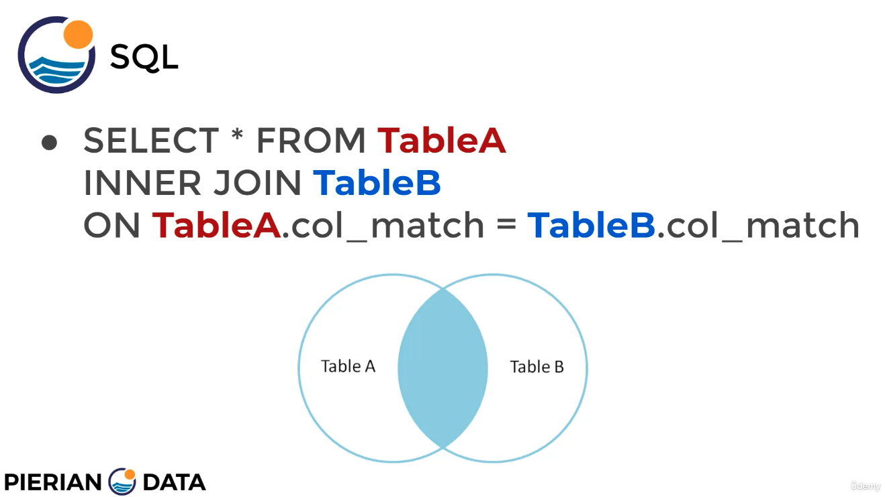

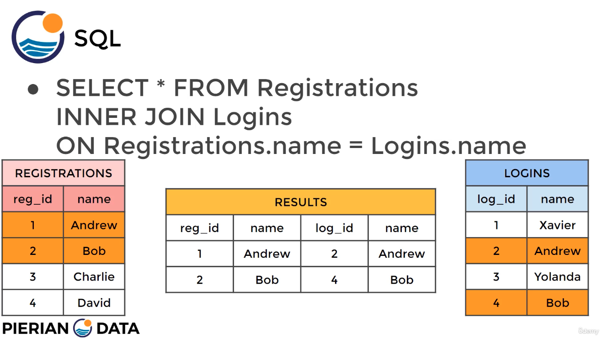

Some remarks:

- `INNER JOIN` is symmetrical: we can swap Table A & B.
- In case tables have columns with the same name, we can specify with `table.col`; otherwise, columns with different/unique names don't need to be specified for table.
- PostgreSQL understands `JOIN` is `INNER JOIN`.

```sql
-- General syntax
-- Note that INNER JOIN is symmetrical: we can interchange TableA and B
SELECT * FROM TableA
INNER JOIN TableB
ON TableA.col_match = TableB.col_match;
-- Example: Who from our customers attended our congress?
SELECT * FROM customer
INNER JOIN attendee
ON customer.name = attendee.name;
-- Same example
-- To avoid col duplications, we can specify which cols to takes instead of *
-- If there are cols with equal names, we use table.col
SELECT customer_id, attendee_id, customer.name FROM customer
INNER JOIN attendee
ON customer.name = attendee.name;
-- dvdrental
--
-- INNER JOIN customers - payments
-- Note that in this example all payments are done by customers
-- so it is not a very good example
SELECT * 
FROM payment
INNER JOIN customer
ON payment.customer_id = customer.customer_id;
-- We can narrow down to the interesting cols
SELECT payment_id, payment.customer_id, first_name
FROM payment
INNER JOIN customer
ON payment.customer_id = customer.customer_id;
```

### 4.3 `FULL OUTER JOIN` + `WHERE`

Whereas the `INNER JOIN` is the default intersection operation, outer joins deal with entries that appear only in one table -- these are more complex.

The simplest outer join is the `FULL OUTER JOIN`: it takes all entries in both tables, independently whether they appear in both or not. Note that:

- Entries in both tables appear only once, not twice
- Entries that are only in one table have NULL values in the selected columns of the other table
- It is symmetric: we can swap tables

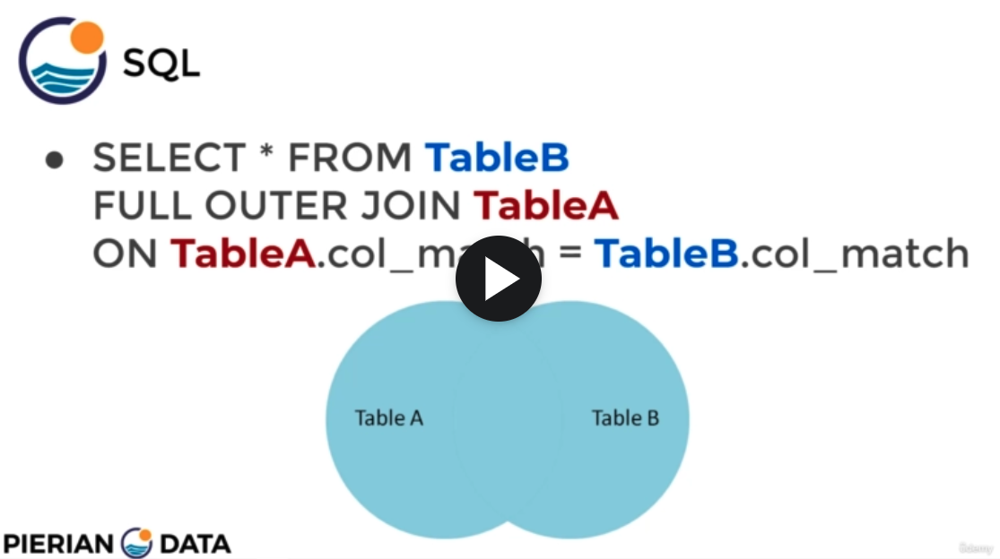

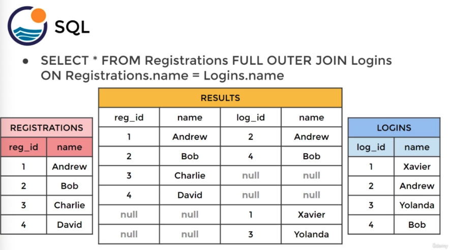

```sql
-- General Syntax
SELECT * FROM TableA
FULL OUTER JOIN TableB
ON TableA.col_match = Table_B.col_match
-- Example
SELECT * FROM Registrations
FULL OUTER JOIN Logins
ON Registrations.name = Logins.name
```

`FULL OUTER JOIN` with `WHERE` can get rows unique to either table = rows not found in both tables. That is the opposite of an `INNER JOIN`! For that, we simply add that a column value (usually the id) must be null.

**IMPORTANT NOTE**: It is the first time I see the use of `IS` instead of `=` or `LIKE`. Note that `IS` is used together with `null`: `IS null`.

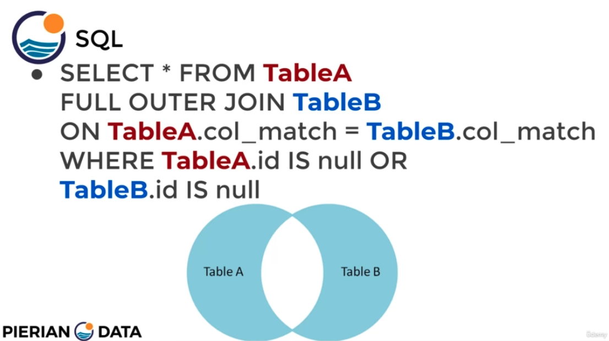

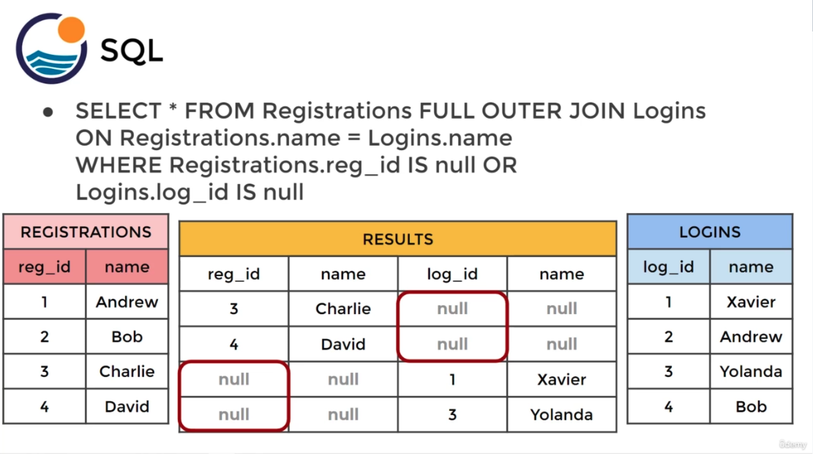

```sql
-- General Syntax: Same as before, but with an addition:
-- we specify that a column value (usually the id) must be null
SELECT * FROM TableA
FULL OUTER JOIN TableB
ON TableA.col_match = Table_B.col_match
WHERE TableA.id is null or TableB.id is null
-- Example
SELECT * FROM Registrations
FULL OUTER JOIN Logins
ON Registrations.name = Logins.name
WHERE TableA.reg_id is null or TableB.log_id is null
--
-- dvdrental
-- Are there customers who have NOT done a payment
-- or payments of people who are not registered as customer?
-- That would check a privacy guideline...
-- There are no such entries: Check
SELECT *
FROM customer
FULL OUTER JOIN payment
ON customer.customer_id = payment.customer_id
WHERE customer.customer_id IS null
OR payment.payment_id IS null;
```

### 4.4 `LEFT (OUTER) JOIN` + `WHERE`

Records that are in the left table; if there is no match with the right table, the results are null. Note that: 

- Now, the query is not symmetric: the order matters: The left table is the first one, after `FROM`!
- `LEFT JOIN` is equivalent to `LEFT OUTER JOIN`.
- The row from the left table that don't have a match in the right table are taken, but null value is set for their values in the columns of the right table, is any are selected.

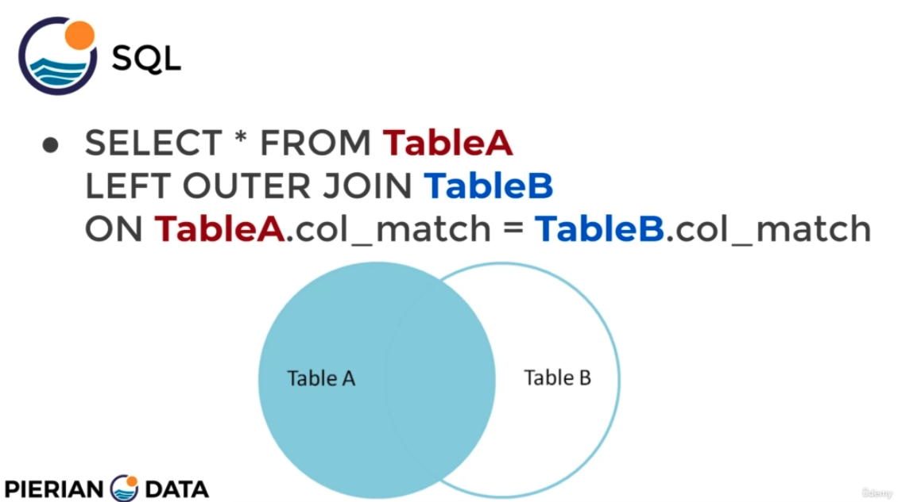

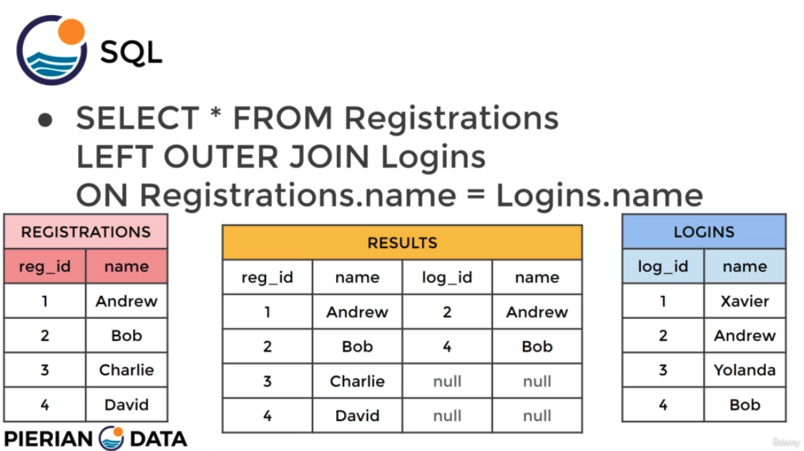

```sql
-- General Syntax
SELECT * FROM TableA
LEFT OUTER JOIN TableB
ON TableA.col_match = Table_B.col_match
-- Example
SELECT * FROM Registrations
LEFT OUTER JOIN Logins
ON Registrations.name = Logins.name
```

`LEFT (OUTER) JOIN` with `WHERE` can yield the entries that only are present in the left table, i.e., all entries that are not in the right table. We get rows unique to the left table.

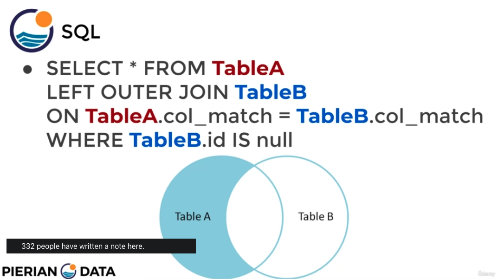

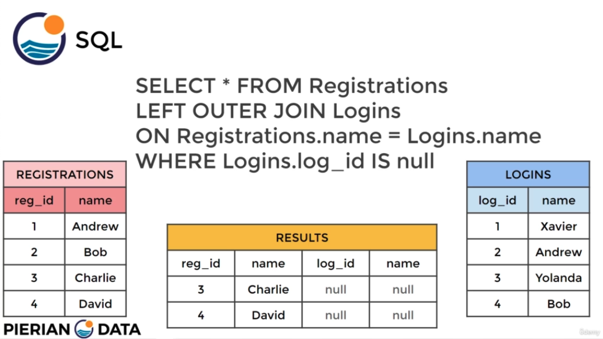

```sql
-- General Syntax
-- Left table: TableA; Right table: TableB
-- WHERE applied on right table
SELECT * FROM TableA
LEFT OUTER JOIN TableB
ON TableA.col_match = Table_B.col_match
WHERE TableB.id IS null
-- Example
SELECT * FROM Registrations
LEFT OUTER JOIN Logins
ON Registrations.name = Logins.name
WHERE Logins.log_id IS null
--
-- dvdrental
-- Example with films and inventory:
-- We can have multiple copies of a film
-- and a film only in one store, not the other(s).
-- Which are the inventory ids of all films?
-- Recall we don't need to specify the table of unique cols
SELECT film.film_id, title, inventory_id
FROM film
LEFT JOIN inventory
ON inventory.film_id = film.film_id;
-- Which films are not in the inventory?
-- We have infor on the films, but we don't have them in the inventory
SELECT film.film_id, title, inventory_id
FROM film
LEFT JOIN inventory
ON inventory.film_id = film.film_id
WHERE inventory.film_id IS null
```

### 4.5 `RIGHT (OUTER) JOIN` + `WHERE`

The `RIGHT (OUTER) JOIN` is equivalent to the `LEFT`, but on the right table. Again, the order matters: the left table is the one after `FROM`, the right is the one after `RIGHT JOIN`. Actually, we can make a `RIGHT JOIN` out of a `LEFT JOIN` just by switching tables in the SQL query.

As with `LEFT JOIN`, if we add `WHERE` we can get rows that are unique/exclusive to the right table

```sql
-- General Syntax
-- Left table: TableA; Right table: TableB
SELECT * FROM TableA
RIGHT OUTER JOIN TableB
ON TableA.col_match = Table_B.col_match
-- WHERE qualifier: get rows unique/exclusive to the right table
-- WHERE applied on left table
SELECT * FROM TableA
RIGHT JOIN TableB
ON TableA.col_match = Table_B.col_match
WHERE TableA.id IS null
```

### 4.6 `UNION`

The result of two SQL queries are stacked or concatenated one after the other.
Note that the two results should match up, so they are often used with tables that are equivalent; e.g., sales of different periods. We can add `ORDER BY` if desired.

```sql
-- General Syntax
SELECT column_name(s) FROM TableA
UNION
SELECT column_name(s) FROM TableB;
-- Example
SELECT * FROM Sales_2021_Q1
UNION
SELECT * FROM Sales_2021_Q2;
ORDER BY name;
```

### 4.7 Challenges: Very Important Examples

```sql
-- dvdrental
--
-- Emails of customers who live in California? (district column is used for states)
SELECT customer_id, district, email
FROM customer
INNER JOIN address
ON customer.address_id = address.address_id
WHERE district LIKE 'California';
-- Movies in which Nick Wahlberg has participated?
-- Involved Tables: film, actor, film_actor
-- We need to do two JOINs in a row:
-- We do the first one, and on the table we get, the next one
-- Tips:
-- 1. In each step, run the query
-- 2. We can start with `SELECT *` and the reduce to the desired columns
SELECT title, first_name, last_name
FROM actor
INNER JOIN film_actor
ON actor.actor_id = film_actor.actor_id
INNER JOIN film
ON film_actor.film_id = film.film_id
WHERE first_name = 'Nick' AND last_name = 'Wahlberg';
```

## 5. Advanced SQL Commands

### 5.1 Obtaining Time Information

Time information can be encoded as
- TIME: only time
- DATE: only date
- TIMESTAMP: date + time
- TIMESTAMPTZ: date + time + time zone

Some functions and operations which are useful when creating tables (not so much for queries):
- `TIMEZONE`
- `NOW`
- `TIMEOFDAY`
- `CURRENT_TIME`
- `CURRENT_DATE`

```sql
-- Show all environment settings (344 in my case)
SHOW ALL;
-- Show time zone (one of those 344 env settings)
SHOW TIMEZONE;
-- Get current TIMESTAMP
SELECT NOW();
-- Same as before, but get it as a string
SELECT TIMEOFDAY();
-- Get current time/date
SELECT CURRENT_TIME;
SELECT CURRENT_DATE;
```

### 5.2 Extracting Time Information

Some helpful functions to process date data:
- `EXTRACT()` can extract sub-components for a date value, such as `YEAR`, `MONTH`, `DAY` or `WEEK`.
- `AGE()`: it gets current age given a timestamp
- `TO_CHAR()`: timestamp formatting; not exclusive for timestamps, though. Look at the [documentation](https://www.postgresql.org/docs/14/functions-formatting.html) for its usage, specially the patterns we have available.

```sql
-- dvdrental
--
-- Given a timestamp column, get the year / month / quarter
-- and show it as a new col pay_year / pay_month / pay_quarter
SELECT EXTRACT(YEAR FROM payment_date) AS pay_year
FROM payment;
SELECT EXTRACT(MONTH FROM payment_date) AS pay_month
FROM payment;
SELECT EXTRACT(QUARTER FROM payment_date) AS pay_quarter
FROM payment;
-- How old are payment timestamps?
SELECT AGE(payment_date)
FROM payment;
-- Formatting the timestamp/date
-- Have a look at the patterns; we can combine the patterns with additional symbols (e.g., '-', '/'):
-- https://www.postgresql.org/docs/14/functions-formatting.html
SELECT TO_CHAR(payment_date, 'MONTH YYYY')
FROM payment;
SELECT TO_CHAR(payment_date, 'MONTH/YYYY')
FROM payment;
SELECT TO_CHAR(payment_date, 'MM/dd/YYYY')
FROM payment;
SELECT TO_CHAR(payment_date, 'mon-dd-YYYY')
FROM payment;
```

Challenge examples:

```sql
-- dvdrental
--
-- Month of the payment
SELECT EXTRACT(MONTH FROM payment_date)
FROM payment;
-- Month of the payment as a string
-- Note that how we write the pattern matters:
-- 'month': january, ...
-- 'Month': January, ...
-- 'MONTH': JANUARY, ...
SELECT TO_CHAR(payment_date, 'Month')
FROM payment;
-- How many payments occurred on Monday?
-- DOW: Day of Week; Sunday has index 0
SELECT COUNT(*) 
FROM payment
WHERE EXTRACT(DOW FROM payment_date) = 1;
```

### 5.3 Mathematical Functions

We have available many [Mathematical Functions and Operators](https://www.postgresql.org/docs/14/functions-math.html): `abs()`, `ceil()`, `exp()`, `ln()`, `power()`, `radians()`, `random()`, `sin()`, `sinh()`...

Some examples of usage:

```sql
-- dvdrental
--
-- Percentage of rental rate vs. replacement cost?
SELECT ROUND(rental_rate/replacement_cost,2)*100 AS percent_cost
FROM film;
-- Create deposit variable as 10% of the replaccement cost
SELECT 0.1*replacement_cost as deposit
FROM film;
```

### 5.4 String Functions and Operations

As with the mathematical functions, we have many [String Functions and Operators](https://www.postgresql.org/docs/14/functions-string.html): string concatenation, string length, search substrings, regular expressions / pattern matching, etc.

Some examples:

```sql
-- dvdrental
--
-- Length of first name?
SELECT LENGTH(first_name)
FROM customer;
-- Concatenate first+last name; we add a white space between
SELECT first_name || ' ' || last_name AS full_name
FROM customer;
-- Upper case
SELECT first_name || ' ' || UPPER(last_name) AS full_name
FROM customer;
-- Create an email following a pattern: John Smith -> jsmith@gmail.com
-- LEFT: take n characters starting from the left
-- LOWER: convert to lower case
SELECT LOWER(LEFT(first_name,1)) || LOWER(last_name) || '@gmail.com'
AS custom_email
FROM customer;
```

### 5.5 Sub-Queries

With a sub-query we can perform queries on the results of a previous query!
The syntax is straightforward: we need to perform two `SELECT` queries.
Some notes:
- The sub-query is inside `()`: `SELECT ... (SELECT ...)`.
- We often first write the sub-query, insert it in `()` and then write the preceding query.
- The sub-query returns value(s) that are used by the main/preceeding query
- Three types of sub-queries:
  1. If the sub-query returns one value (e.g., with `AVG()`), we can use logical operators: `>, <, ...`
  2. If the sub-query returns several vaues, we need to use `IN` on a key column: that is like an inner join
  3. Sub-queries can be used with the `EXISTS()` function, which receives a `SELECT` sub-query as argument. That is like using `IN` or an inner join, but we don't need to specify the key column.
- As we start performing sub-queries, we need to have clearly in mind the complete database and its relationships; sub-queries are like piping results from query to query.
- Ordering with `ORDER BY` is done **after** the sub-query!

Generic examples: 

```sql
-- Example 1: Sub-query returns one value
-- Which students have a score above the average?
-- The sub-query in () is executed and its value is used
-- We can use logical operators if the sub-query returns a value
SELECT student, grade
FROM test_scores
WHERE grade > (SELECT AVG(grade) FROM test_scores)
-- Example 2: Sub-query returns several values
-- If the sub-query returns several values,
-- we need to use IN, similarly to a JOIN
SELECT student, grade
FROM test_scores
WHERE student IN
(SELECT student FROM honor_roll_table)
-- Example 3: EXISTS()
SELECT column_name
FROM table_name
WHERE EXISTS
(SELECT column_name FROM
table_name WHERE condition);
```

Examples with `dvdrental`:

```sql
-- dvdrental
-- 
-- Example 1: Sub-query returns one value
-- All movies that have a rental rate above the average?
SELECT title, rental_rate
FROM film
WHERE rental_rate >
(SELECT AVG(rental_rate) FROM film)
-- Example 2: Sub-query returns several values
-- All film titles that have been returned between two dates?
-- We need to perform an inner join between inventory and rental to get the film ids
-- and then use the film ids to get the titles!
-- ORDER BY comes after the sub-query
SELECT title FROM film
WHERE film_id IN
(SELECT inventory.film_id
FROM rental
INNER JOIN inventory ON inventory.inventory_id = rental.inventory_id
WHERE return_date BETWEEN '2005-05-29' AND '2005-05-30')
ORDER BY title
-- Example 3: EXISTS()
-- All customers with a payment above 11 USD?
-- Note that this is equivalent to IN / INNER JOIN
-- but no key columns are specified, just the existence of rows is checked
SELECT first_name, last_name
FROM customer AS c
WHERE EXISTS
(SELECT * FROM payment as p
WHERE p.customer_id = c.customer_id
AND amount > 11)
-- Same as before, but customers that have NOT a payment above 11 USD
SELECT first_name, last_name
FROM customer AS c
WHERE NOT EXISTS
(SELECT * FROM payment as p
WHERE p.customer_id = c.customer_id
AND amount > 11)
```

### 5.6 Self-Joins

A self-join is a query in which a table is joined to itself. There is no special keyword for them, but the table needs to be aliased into two tables to avoid confusions. For instance, it can be used to get rows that have different columns with matching values.

```sql
-- Generic example: not we create two aliases of the same table
SELECT tableA.col, tableB.col
FROM table AS tableA
INNER JOIN table as tableB
tableA.some_col = tableB.other_col
```

Example: we have a table `employees` in which we register for each employee id, to whom (employee id) they send a report for reading. We want to match names of report writers and readers.

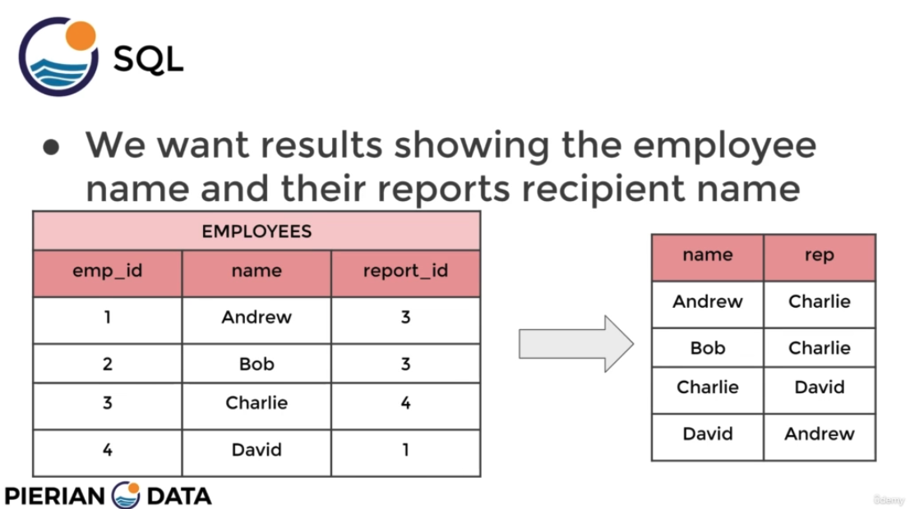

```sql
SELECT tableA.name, tableB.name AS recipient
FROM employees AS tableA
INNER JOIN employees as tableB
tableA.emp_id = tableB.report_id
```

Example with `dvdrental`:

```sql
-- dvdrental
--
-- All the film pairs with the same length/duration?
SELECT f1.title, f2.title, f1.length
FROM film AS f1
INNER JOIN film as f2
ON f1.film_id != f2.film_id
AND f1.length = f2.length
```


## Assessments
### Assessment 1 (After Section 3: Fundamentals + `GROUP BY`)

1. Return the customer IDs of customers who have spent at least $110 with the staff member who has an ID of 2.

The answer should be customers 187 and 148.

```sql
SELECT customer_id, staff_id, SUM(amount)
FROM payment
WHERE staff_id = 2
GROUP BY customer_id, staff_id
HAVING SUM(amount) >= 110;
```

2. How many films begin with the letter J?

The answer should be 20.

```sql
SELECT COUNT(*)
FROM film
WHERE title LIKE 'J%'
```

3. What customer has the highest customer ID number whose name starts with an 'E' and has an address ID lower than 500?

The answer is Eddie Tomlin

```sql
SELECT first_name, last_name
FROM customer
WHERE first_name LIKE 'E%' AND address_id < 500
ORDER BY customer_id DESC
LIMIT 1;
```

### Assessment 2 (After Section 5: Joins & Advanced Commands)

A new database is provided, which needs to be restored as explained in Section 1.1:

`./data/exercises.tar`

After restoring it, we right-click on the left menu column of `pgAdmin` and select `Query Tool`.
Note that the database has 2 schemas; we work with the schema `cd`, which has 3 tables:

- `bookings`
- `facilities`
- `members`

The database contains information of a sports resort that has facilities (e.g., tennis courts) booked by members.

To select between schemas, every table in `cd` needs to be preceeded with `cd.`:

```sql
SELECT * FROM cd.bookings;
SELECT * FROM cd.facilities;
SELECT * FROM cd.members;
```

Exercises:

```sql
-- 1. Retrieve all the information from the cd.facilities table
SELECT * FROM cd.facilities;
-- 2. Retrieve a list of only facility names and costs
SELECT name, membercost FROM cd.facilities;
-- 3. Facilities that charge a fee to members
SELECT * FROM cd.facilities
WHERE membercost > 0
-- 4. Facilities that charge a fee less than 1/50th of the monthly maintenance cost to members
SELECT facid, name, membercost, monthlymaintenance FROM cd.facilities
WHERE membercost < monthlymaintenance/50
-- 5. Facilities with the word 'Tennis' in their name
SELECT * FROM cd.facilities
WHERE name LIKE '%Tennis%'
-- 6. Details of facilities with ID1 and 5
SELECT * FROM cd.facilities
WHERE facid IN (1, 5)
-- 7. Members who joined after the start of September 2012
SELECT memid, surname, firstname, joindate FROM cd.members
WHERE joindate > '2012-09-01'
-- 8. Ordered list of the first 10 surnames in the members table
SELECT DISTINCT surname FROM cd.members
ORDER BY surname ASC
LIMIT 10
-- 9. Signup date of your last member
SELECT joindate FROM cd.members
ORDER BY joindate DESC
LIMIT 1
--
SELECT MAX(joindate)
FROM cd.members
-- 10. Number of facilities that have a cost to guests of 10 or more
SELECT COUNT(*)
FROM cd.facilities
WHERE guestcost >= 10
-- 11. Number of slots booked per facility in the month of September 2012
SELECT facid, SUM(slots)
FROM cd.bookings
WHERE EXTRACT(MONTH FROM starttime) = 9
AND EXTRACT(YEAR FROM starttime) = 2012
GROUP BY facid
-- 12. Facilities with more than 1000 slots booked
SELECT facid, SUM(slots) AS total_slots
FROM cd.bookings
GROUP BY facid
HAVING SUM(slots) > 1000
ORDER BY facid
-- 13. Start times for bookings for tennis courts, for the date '2012-09-21'
SELECT starttime, name
FROM cd.bookings
INNER JOIN cd.facilities
ON cd.bookings.facid = cd.facilities.facid
WHERE EXTRACT(YEAR FROM starttime) = 2012
AND EXTRACT(MONTH FROM starttime) = 9
AND EXTRACT(DAY FROM starttime) = 21
AND name LIKE '%Tennis Court%'
ORDER BY starttimes
-- 14. Start times for bookings by members named 'David Farrell'
SELECT bookid, starttime, firstname || ' ' || surname
FROM cd.bookings
INNER JOIN cd.members
ON cd.bookings.memid = cd.members.memid
WHERE firstname LIKE 'David'
AND surname LIKE 'Farrell'
```